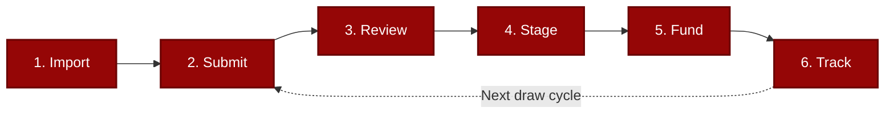
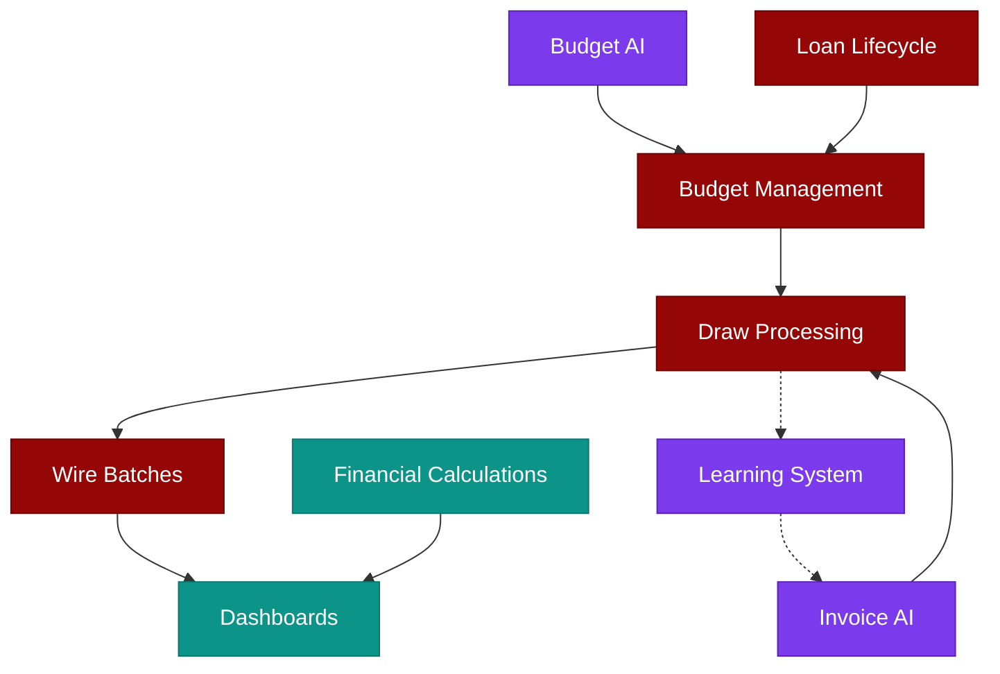

# TD3

**Draw Management Built for How We Actually Work**

[td3.tennantdevelopments.com](https://td3.tennantdevelopments.com)

TD3 is an internal system that brings order to construction loan servicing. It replaces scattered spreadsheets, buried emails, and manual reconciliation with a single place where every loan, budget, draw, and approval is visible, trackable, and auditable.

This isn't about adopting more software. It's about reducing the mental overhead of keeping everything straight---so we can focus on decisions instead of data entry.

---

## Why TD3

| Challenge | TD3 Solution |
|-----------|--------------|
| Hours compiling reports from scattered spreadsheets | Real-time dashboards, zero compilation |
| Manual invoice matching, one line at a time | [AI matches invoices in seconds](docs/ARTIFICIAL_INTELLIGENCE.md#invoice-to-budget-matching) |
| Audit prep means detective work | Complete audit trail writes itself |
| Budget categories inconsistent across loans | [AI standardizes to TD3's cost codes automatically](docs/ARTIFICIAL_INTELLIGENCE.md#budget-standardization) |
| Funding status lives in someone's head | Wire batch tracking with full history |

---

## The Problem

Construction lending runs on a lot of moving pieces---budgets, draw requests, approvals, invoices, wire details---and standard office tools spread that information across many places. For details on the data model that addresses this, see [Architecture: Data Architecture](docs/ARCHITECTURE.md#data-architecture).

### Fragmented Information

When loan data lives in spreadsheets, email threads, and personal notes, routine tasks take longer than they need to:

- **Version ambiguity.** Multiple copies of a budget spreadsheet make it unclear which is current.
- **Scattered context.** Approvals and exceptions discussed over email are difficult to reconstruct months later.
- **Manual reporting.** Compiling a portfolio status means pulling data from several sources and reconciling by hand.
- **Audit overhead.** Demonstrating the history of a loan means assembling records from many places.

### Repetitive Manual Work

A significant share of operational hours goes to tasks that are mechanical rather than analytical:

- **Budget categorization.** Every new project means classifying line items individually, with natural variation across loans.
- **Invoice matching.** Each draw request means comparing invoices to budget categories, checking amounts, and flagging mismatches one at a time.
- **Data re-entry.** Moving numbers between systems takes time that could go toward analysis and decision-making.

TD3 automates these processes so the team can operate more efficiently and more profitably with the same workload.

---

## The Solution

TD3 addresses both problems directly: **one place for everything** and **automation for the repetitive stuff**.

### A Single Source of Truth

Every loan, builder, budget, draw request, invoice, and approval lives in one system. Not spreadsheets with version numbers in the filename---a real database that stays current. See [Technical Architecture: System Overview](docs/ARCHITECTURE.md#system-architecture) for the full platform diagram.

This means:

- **The current state is always obvious.** Open the dashboard and see exactly where things stand---across the portfolio or for any individual loan.
- **History is preserved automatically.** Every change, every approval, every upload is timestamped and attributed. The audit trail writes itself.
- **Reporting is instant.** No more compiling. The data is already structured. Generate reports in seconds, not hours.
- **Anyone can pick up where someone else left off.** Context isn't trapped in someone's head or inbox. It's in the system.

When the current state is obvious, less mental energy goes to "wait, where is that?" and more goes to actual decisions.

### Intelligent Automation Where It Matters

TD3 uses AI to handle the tedious, repetitive tasks that currently eat hours. For the complete AI reference---including model selection, confidence thresholds, and the training data pipeline---see [Artificial Intelligence in TD3](docs/ARTIFICIAL_INTELLIGENCE.md).

- **Automatic budget standardization.** Upload a builder's budget spreadsheet, and AI classifies each line item to [TD3's standardized cost codes](docs/ARTIFICIAL_INTELLIGENCE.md#td3s-standardized-cost-code-system)---a proprietary system of 12 parent categories and 89 subcategories covering every phase of residential construction. Consistent categorization across every project, every time.
- **Smart invoice matching.** Upload invoices with a draw request, and AI extracts vendor names, amounts, and descriptions---then [matches them to the right budget lines automatically](docs/ARTIFICIAL_INTELLIGENCE.md#invoice-to-budget-matching) using semantic reasoning about construction terminology. A [three-tier confidence system](docs/ARTIFICIAL_INTELLIGENCE.md#confidence-gated-automation) routes high-certainty matches through automatically while flagging ambiguous cases for human review.
- **Built-in validation.** The system flags over-budget requests, duplicate invoices, and missing documentation before you even see them. Problems surface early, not after funding.

The key insight: AI handles the pattern matching and data extraction. Humans review the results and make decisions. Tasks that took hours complete in seconds---with better consistency.

---

## How It Works

The day-to-day workflow follows six steps, from initial budget import through portfolio tracking:

1. **Import** --- Upload a builder's budget spreadsheet. TD3 detects categories and amounts, you confirm the mapping, and AI standardizes everything to [TD3's cost codes](docs/ARTIFICIAL_INTELLIGENCE.md#budget-standardization).

2. **Submit** --- When a draw comes in, upload the request. AI matches draw amounts to existing budget lines automatically. See [Architecture: Draw Processing](docs/ARCHITECTURE.md#draw-processing-workflow).

3. **Review** --- See the full picture: amounts, budget status, flags, invoices. Resolve any issues directly in the interface. See [AI Invoice Matching](docs/ARTIFICIAL_INTELLIGENCE.md#invoice-to-budget-matching) for how invoices are matched.

4. **Stage** --- Approved draws move to staging. See all staged draws grouped by builder, ready for wire transfer.

5. **Fund** --- Select a funding date, add wire reference if needed, and mark draws as funded with one click. Budget spent amounts update atomically. See [Architecture: Wire Batch Funding](docs/ARCHITECTURE.md#wire-batch-funding).

6. **Track** --- Dashboards show real-time status across the portfolio. Budget utilization, draw history, interest accrual, amortization schedules---all visible without compiling anything. See [Architecture: System Overview](docs/ARCHITECTURE.md#system-architecture).

---

## Platform Capabilities

| Area | What It Does | Details |
|------|-------------|---------|
| Portfolio Visibility | Dual dashboards, smart filtering, risk indicators, builder timelines | [Architecture: System Overview](docs/ARCHITECTURE.md#system-architecture) |
| Loan Lifecycle | Origination through payoff with stage-specific views and metrics | [Architecture: Loan Lifecycle](docs/ARCHITECTURE.md#loan-lifecycle-management) |
| Budget Intelligence | AI categorization to standardized cost codes, inline editing, import protection | [AI: Budget Standardization](docs/ARTIFICIAL_INTELLIGENCE.md#budget-standardization) |
| Draw Processing | Multi-stage workflow with fuzzy matching and automated validation | [Architecture: Draw Workflow](docs/ARCHITECTURE.md#draw-processing-workflow) |
| Wire Batches | Consolidated builder payments with funding reports and audit trail | [Architecture: Wire Batches](docs/ARCHITECTURE.md#wire-batch-funding) |
| AI Invoice Matching | AI extraction, semantic matching, confidence-gated automation, and learning | [AI: Invoice-to-Budget Matching](docs/ARTIFICIAL_INTELLIGENCE.md#invoice-to-budget-matching) |
| Financial Calculations | Compound interest, fee escalation, IRR, payoff projections | [Architecture: Data Architecture](docs/ARCHITECTURE.md#data-architecture) |
| Compliance & Audit | Immutable records, timestamped actions, document verification | [Architecture: Security Model](docs/ARCHITECTURE.md#security-model) |
| AI Intelligence | Budget standardization, invoice extraction, semantic matching, self-improving system | [Artificial Intelligence in TD3](docs/ARTIFICIAL_INTELLIGENCE.md) |

Every capability listed above is built on [TD3's standardized cost code system](docs/ARTIFICIAL_INTELLIGENCE.md#td3s-standardized-cost-code-system)---a proprietary framework of 12 parent categories and 89 subcategories that maps every builder's unique terminology to a single canonical structure. This standardization is what makes cross-project comparison, portfolio analytics, and AI-powered automation possible.

---

## Security & Compliance

TD3 uses passwordless authentication with a pre-authorized access list, so only approved team members can sign in---no passwords to manage or compromise. Four stackable permissions control exactly what each user can do, enforced at the database level through row-level security. Every action is recorded in an immutable audit trail with timestamps and user attribution.

The interface adapts to each user's permission set---controls and actions that a user cannot perform are hidden rather than disabled, keeping the experience clean and focused. See [Architecture: Security Model](docs/ARCHITECTURE.md#security-model) for the full security architecture and [Design Language: Polymorphic Behaviors](docs/DESIGN_LANGUAGE.md#7-polymorphic-behaviors) for how the UI adapts to context and role.

---

## What's Next

The platform is live and operational. Upcoming work focuses on three areas:

**Integrations & Portals** --- Electronic signature integration for loan documents, interactive notification cards for approvals and funding requests, and dedicated portals so builders and lenders can access their own data directly. See [Roadmap: Upcoming Features](docs/ROADMAP.md#upcoming-features).

**AI Intelligence** --- The system already captures structured [training data](docs/ARTIFICIAL_INTELLIGENCE.md#training-data-and-the-path-to-self-improvement) from every funded draw---vendor-to-category associations, human corrections, and confidence calibration data. Next steps include:

- [Portfolio intelligence](docs/ROADMAP.md#portfolio-intelligence-rag-chatbot) --- A natural-language query interface that translates portfolio questions into database queries, grounded in real data to prevent hallucination.
- [Self-improving invoice matching](docs/ROADMAP.md#self-improving-invoice-matching) --- Vendor history and human corrections feed back into AI prompts, creating a virtuous cycle where accuracy improves with every funded draw.
- [Builder performance analytics](docs/ROADMAP.md#builder-performance-intelligence) --- Cross-loan comparison of builder costs, timeline adherence, and draw patterns using standardized cost codes.
- [Predictive analytics](docs/ROADMAP.md#predictive-analytics) --- Cash flow forecasting, budget risk modeling, and completion timeline estimation based on historical builder performance.

**Field Tools** --- A [mobile inspection app](docs/ROADMAP.md#mobile-inspection-app) for field teams conducting on-site construction inspections, with photos and checklists linked directly to project budgets and draw requests.

See the [Development Roadmap](docs/ROADMAP.md) for the full timeline, feature details, and Gantt chart.

---

## Documentation

TD3's documentation is organized into four deep-dive guides, each covering a specific aspect of the platform. This README serves as the index---start here, then follow the links below for detailed information.

| Document | What It Covers | Key Topics |
|----------|---------------|------------|
| [Technical Architecture](docs/ARCHITECTURE.md) | System design, data model, deployment infrastructure, and the security model that governs all access | System layers, loan lifecycle stages, draw processing workflow, wire batch funding, data architecture, row-level security, audit trail |
| [Artificial Intelligence](docs/ARTIFICIAL_INTELLIGENCE.md) | How AI is used at each stage of the loan servicing workflow, from budget import through invoice matching and beyond | TD3's cost code system, budget standardization, invoice data extraction, semantic matching, confidence-gated automation, training data capture, self-improvement loop, model selection rationale |
| [Development Roadmap](docs/ROADMAP.md) | Upcoming features with timelines, implementation details, and Gantt chart | DocuSign integration, Adaptive Cards, builder and lender portals, portfolio RAG chatbot, mobile inspection app, self-improving matching, builder performance intelligence, predictive analytics |
| [Design Language](docs/DESIGN_LANGUAGE.md) | Visual design system governing every screen in TD3, from color tokens to component specifications | Brand colors, neutral palette, semantic colors, typography scale, spacing grid, elevation system, motion patterns, polymorphic behaviors, accessibility standards |

---

## About

**TD3** --- Construction loan management, built by Grayson Graham. Contact: grysngrhm@gmail.com

---

*© 2024-2026 TD3, built by Grayson Graham. All rights reserved.*
