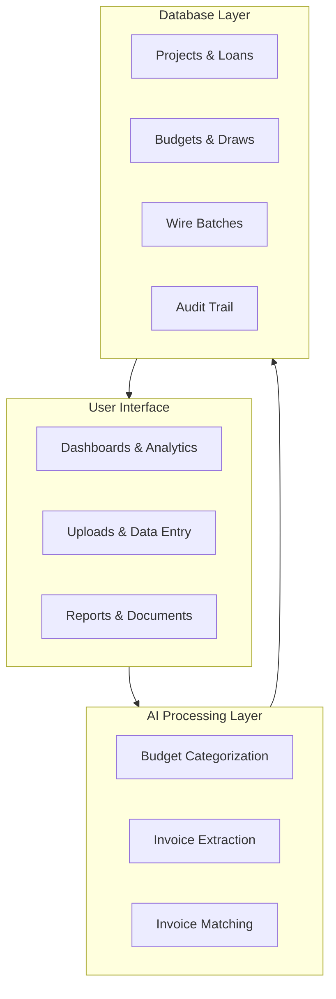
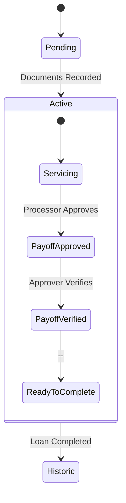
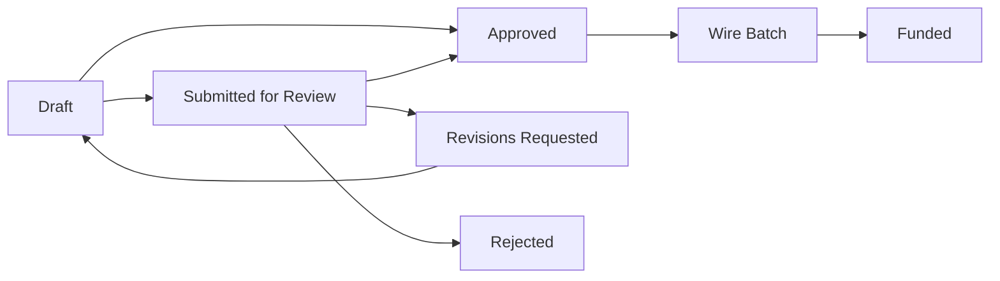
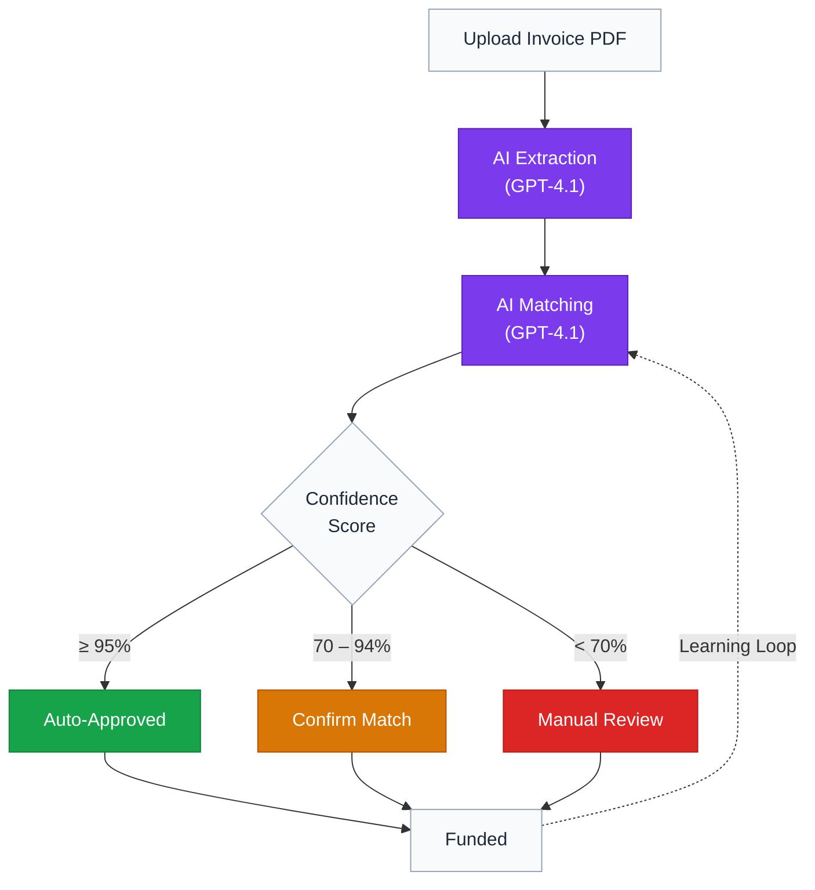

# TD3 Technical Architecture

## Overview

TD3 is a construction loan management platform that replaces fragmented spreadsheet workflows with a unified system for tracking loans, budgets, draws, and wire transfers. The platform combines a modern web interface with AI-powered automation and a secure relational database.

For business context and a high-level workflow overview, see the [README](../README.md).

---

## Table of Contents

1. [Overview](#overview)
2. [System Architecture](#system-architecture)
3. [Core Platform](#core-platform)
   - [Loan Lifecycle Management](#loan-lifecycle-management)
   - [Budget Intelligence](#budget-intelligence)
   - [Draw Processing Workflow](#draw-processing-workflow)
   - [Wire Batch Funding](#wire-batch-funding)
   - [Payoff Workflow](#payoff-workflow)
   - [Invoice Matching](#invoice-matching)
4. [AI Integration](#ai-integration)
5. [Security Model](#security-model)
6. [Data Architecture](#data-architecture)
7. [Deployment](#deployment)
8. [Related Documentation](#related-documentation)

---

## System Architecture

The system is organized into three layers:

- **User Interface** -- A server-rendered web application with client-side interactivity. Users interact with dashboards for portfolio management, upload forms for importing budgets and invoices, and polymorphic report views that present data as tables, charts, or formatted documents.

- **AI Processing Layer** -- An external automation engine handles computationally intensive tasks: categorizing budget line items against standardized cost codes, extracting structured data from uploaded invoice PDFs, and matching invoices to draw request lines with confidence scoring. For a detailed breakdown of each AI capability, see [Artificial Intelligence in TD3](ARTIFICIAL_INTELLIGENCE.md).

- **Database Layer** -- A managed relational database with row-level security stores all business data. Every entity change is recorded in an immutable audit trail, ensuring complete traceability of financial transactions.

---

## Core Platform

### Loan Lifecycle Management

Every construction loan progresses through three stages:

- **Pending** -- Loan origination. Term sheet fields are entered, the builder and lender are linked, and documents are prepared for execution.
- **Active** -- The loan is funded and in progress. Budgets are tracked, draws are processed, and compound interest accrues in real time. When a loan is ready for payoff, it follows a three-step approval workflow (approve, verify, complete) before transitioning to historic.
- **Historic** -- The loan has been paid off. All data is preserved as an immutable record for performance analysis and auditing.

The platform supports multiple builders, subdivisions, and lenders, with each loan linking to all three. Each entity has a dedicated management surface (`/builders/[id]`, `/subdivisions/[id]`, `/lenders/[id]`) where its details, defaults, and loan portfolio are viewable and editable. Cross-entity navigation is three-way: every loan grid on these pages links its rows to the corresponding project, builder, subdivision, and lender detail pages.

### Loan-Term Inheritance and Signing-Time Lock

Every loan has its effective interest rate, origination fee, and term resolved through a three-tier hierarchy: **project `_override`** column → **lender `default_*`** column → **system constant**. The resolver lives in `lib/loanTerms.ts::resolveEffectiveTerms` and feeds every downstream calculation (origination tab display, payoff projections, Adaptive Card payoff math, reports).

**Critical legal constraint**: an interest rate in a signed loan agreement cannot legally change retroactively for one year from signing. To enforce this in the data model, every active and historic loan has its `interest_rate_override`, `origination_fee_pct_override`, and `loan_term_months_override` columns populated at signing — snapshotting whatever the lender's defaults were at that moment. As a result, editing a lender's `default_*` column only affects **new** loans (those without overrides yet); existing loans are immune. The Lender Loan Defaults card surfaces this constraint with a confirmation modal on every save plus messaging that explicitly notes existing loans are unaffected.

### Budget Intelligence

When a builder submits a budget spreadsheet, the system automatically detects column headers and row boundaries, then sends each line item to the AI processing layer for categorization against TD3's standardized cost code system.

TD3 uses a proprietary cost code framework inspired by the National Association of Home Builders (NAHB). The system organizes all construction costs into **12 parent categories** with **89 subcategories**, covering every phase of residential construction from pre-build expenses through final landscaping. Categories are numbered in 100-point increments and follow the chronological order of construction---the sequence a typical residential build progresses through from groundbreaking to completion.

This standardization is what makes cross-project comparison, builder performance tracking, and portfolio-level analytics possible. Every builder's unique naming conventions are mapped to a single canonical structure.

Users review and adjust AI-suggested categories through cascading dropdowns before approving the budget. Once draws are funded against a budget line, that line is protected from deletion during re-imports.

The Progress Budget Report provides both table and chart views of budget data. The table groups budget lines into a three-level hierarchy---NAHB category, subcategory (merging duplicate mappings), and individual builder line items---each expandable with draw history. The chart view includes a fund flow Sankey, a funding timeline stacked area chart, and an interactive budget breakdown pie with subcategory drill-down. All three charts use a unified color mapping so each NAHB category is visually consistent across visualizations.

> For details on the cost code system, AI model selection, and confidence scoring, see [Budget Standardization](ARTIFICIAL_INTELLIGENCE.md#budget-standardization).

### Draw Processing Workflow

Draw requests follow a structured lifecycle. Two entry paths exist depending on the actor:

- **Staff path**: a processor uploads or creates a draw and approves it directly (`draft → approved`), bypassing the review step.
- **Builder path**: a builder team member creates a draft on a loan they have access to, uploads invoices, and submits it for processor review (`draft → submitted_for_review`). The processor can approve, request revisions (which sends the draw back to draft with a note), or reject (terminal).

Once approved, draws are grouped by builder into wire batches. The batch is sent to the bookkeeper for wire processing with a detailed funding report. Once the wire is confirmed, budget spent amounts are atomically updated and the draw is locked as an immutable record.

The state machine and per-state edit/transition permissions are encoded in `lib/drawLifecycle.ts`. Shared transition helpers in `lib/drawTransitions.ts` are idempotent (re-submitting an already-submitted draw returns `alreadyInState`). Since Cards v2 (April 2026), the draw review flow runs through the in-app UI only — the draw review Adaptive Card is informational and sends the processor to TD3 to review rather than exposing Approve / Request Changes / Reject actions inline. Responsible review requires looking at invoice PDFs and budget context that don't fit in a card.

> For details on how AI handles invoice matching during the validation step, see [Invoice-to-Budget Matching](ARTIFICIAL_INTELLIGENCE.md#invoice-to-budget-matching). For the full builder portal model, see [PERMISSIONS_NOTIFICATIONS_V2.md](PERMISSIONS_NOTIFICATIONS_V2.md).

### Wire Batch Funding

Wire batches consolidate multiple draws for the same builder into a single wire transfer. This reduces banking fees and simplifies bookkeeping. Each batch includes:

- A funding report with per-draw breakdowns
- Builder banking information for the wire
- Status tracking from creation through confirmation
- Complete audit trail of all actions

### Payoff Workflow

When a construction loan reaches completion, the payoff workflow manages the transition from active servicing to final settlement. The process is governed by a three-step approval pipeline with separation of duties enforced at the permission level.

**Approval Pipeline**

1. **Approve** (requires `processor` permission) -- A processor reviews the calculated payoff statement, optionally adjusts the final balance with credits or debits, and approves. This locks the adjustments into a structured record and captures who approved and when.
2. **Verify** (requires `approve_payoffs` permission) -- A second user with payoff approval authority independently verifies the statement. The statement transitions from draft to approved status. Processors can also revise an approval if corrections are needed, returning the workflow to step one.
3. **Complete** (requires `processor` permission) -- The processor records the actual payoff date and the actual amount received (which may differ from the statement amount), then the loan transitions to historic.

**Payoff Statement**

The system generates a print-ready payoff statement that serves as both an internal review document and an external deliverable. The statement includes:

- Borrower, property, and loan details
- Line items: principal balance, accrued interest, document fee, and finance fee
- Adjustments (credits and debits applied during the approval step)
- Per diem rate, wire instructions, and disclaimer
- Approval audit trail showing who approved and verified the statement
- A draft or approved watermark based on verification status

The statement is downloadable as a PDF rendered entirely on the client side.

**Financial Calculations**

Interest and fees are computed in real time based on the loan terms and draw history:

- **Compound interest** accrues at month-end and at each draw funding event, compounding on the running balance.
- **Fee escalation** follows a defined schedule: 2% flat for months one through six, increasing by 0.25% per month for months seven through twelve, a 5.9% extension fee at month thirteen, and an additional 0.4% per month thereafter.
- **Per diem** is the daily interest on the total balance (principal plus accrued interest), used to calculate payoff amounts for specific dates.
- **Finance fee** is the fee rate multiplied by **total principal drawn (high-water mark)** — i.e. the maximum cumulative principal drawn over the loan's life, not the current outstanding balance and not the committed loan amount. Paydowns do not reduce the fee base.

**Principal Paydowns**

A loan can receive partial principal repayments from the borrower before final payoff. Paydowns are first-class events with their own table (`principal_paydowns`), captured on a per-event basis with a date, amount, and optional wire reference. They feed into the calculations as follows:

- **Compound interest**: paydown events join draw events in the chronological accrual schedule. After each paydown, the running balance drops, so subsequent interest accrues on the lower base. Balance is clamped at zero, so an overpaid loan still produces a sensible projection.
- **Finance fee**: unchanged. The fee base is the high-water mark of cumulative principal drawn, computed in a single pass through the merged event list. Paydowns do not lower this base — a borrower who draws $700k, pays down $200k, then redraws $100k still has a fee base of $700k.
- **IRR**: each paydown contributes a positive cash inflow on its `paydown_date`. The Newton-Raphson IRR solver sees paydowns as money returned to the lender, which raises the effective return when paydowns happen early.
- **Income breakdown**: when a payoff is recorded, total income equals `payoff_amount + sum(paydowns) − sum(funded_draws)`. The accrued-interest line is reduced by the time-weighted interest on each paydown for the days between paydown and payoff. The hold fee is unchanged (uses high-water mark).

The payoff statement renders paydowns as a separate line below "Principal Balance" — both the gross drawn total and the negative paydown subtotal contribute transparently to the balance due. Paydowns are gated by the same `processor` permission as draws, lock once a payoff statement reaches `payoff_approved`, and write to the unified activity log on create and delete.

The `record_principal_paydown` Postgres RPC handles the create flow inside a transaction with `SELECT ... FOR UPDATE` on the project row, preventing concurrent overpay attempts from each passing the outstanding-balance check.

**Chart Dashboard**

The payoff tab includes a chart view with three interactive visualizations:

- **Fee Escalation Timeline** -- A step chart showing how the fee rate progresses over an eighteen-month period, highlighting the extension threshold.
- **Payoff Projection** -- A line chart plotting interest growth and total payoff amount over time.
- **What-If Comparison** -- A stacked bar chart comparing the cost of paying off the loan at different future dates, helping borrowers quantify the impact of timing.

### Invoice Matching

The invoice system uses a two-stage AI pipeline to process uploaded invoices:

1. **AI Extraction** -- Invoice PDFs are sent to the AI processing layer, which extracts vendor name, amount, description, trade classification, and other structured data from the unstructured document.
2. **AI Matching** -- The extracted data is evaluated against all open draw request lines using semantic reasoning about construction terminology, trade alignment, amount similarity, and vendor history. A confidence score determines whether the match is applied automatically, presented for quick confirmation, or routed to full manual review.

Every match decision---automatic or manual---is recorded for auditing, and approved matches feed into a learning system that improves future accuracy.

> For the complete invoice matching system, including the confidence-gated automation tiers, semantic reasoning approach, and review experience, see [Artificial Intelligence: Invoice-to-Budget Matching](ARTIFICIAL_INTELLIGENCE.md#invoice-to-budget-matching).

The complete invoice processing pipeline from upload through funding:

---

## AI Integration

TD3 integrates artificial intelligence at three critical points in the construction loan servicing workflow:

- **Budget Categorization** -- Mapping builder-specific line items to TD3's standardized cost codes with confidence scoring. See [Budget Standardization](ARTIFICIAL_INTELLIGENCE.md#budget-standardization).
- **Invoice Extraction** -- Converting unstructured invoice PDFs into structured data records the system can reason about. See [Invoice Data Extraction](ARTIFICIAL_INTELLIGENCE.md#invoice-data-extraction).
- **Invoice Matching** -- Evaluating extracted invoice data against draw request lines using multi-factor semantic reasoning. See [Invoice-to-Budget Matching](ARTIFICIAL_INTELLIGENCE.md#invoice-to-budget-matching).

The guiding principle: **AI handles pattern matching and data extraction; humans retain decision authority.** Every AI decision is confidence-scored, auditable, and subject to human review. Nothing is funded without a person in the loop.

For the full AI reference---including model selection rationale, confidence thresholds, the training data pipeline, and the self-improvement roadmap---see [Artificial Intelligence in TD3](ARTIFICIAL_INTELLIGENCE.md).

---

## Security Model

TD3's comprehensive security architecture is documented in the dedicated [Security](SECURITY.md#overview) guide, covering authentication, the permission model, data-level enforcement, audit trail, AI security guardrails, and infrastructure security.

Permissions are layered: four global staff codes (`processor`, `fund_draws`, `approve_payoffs`, `users.manage`) plus a fifth code (`builder_portal`) that marks external builder users. Builder users are scoped to specific builders via the `builder_members` table, and row-level security combines the two layers disjunctively — staff see all rows; builders see only data tied to a builder they're a member of. The interface adapts to each user's permission set: controls and actions a user cannot perform are hidden rather than disabled, and pages outside their scope redirect them home. For details on role-adaptive design patterns, see the [Design Language: Polymorphic Behaviors](DESIGN_LANGUAGE.md#7-polymorphic-behaviors).

**Banking data is masked by default.** Builder bank routing and account numbers are stored in full in the `builders` table for the bookkeeper's wire workflow, but every other rendering surface — Adaptive Cards, fallback HTML emails, and most in-app views — reads the generated `bank_routing_last4` / `bank_account_last4` columns instead. The plaintext values are only shown on `/staging` (the bookkeeper's wire processing page) and on the BuilderInfoCard (where the builder owns their own data). This keeps numbers out of inboxes that get forwarded, screenshotted, or scanned by enterprise security tooling.

---

## Data Architecture

The data model centers on **Projects**---each representing a single construction loan. A project links to a **Builder** (the contractor performing the work) and a **Lender** (the institution funding the loan). Builders carry banking information used for wire transfers.

Each project has a set of **Budgets**: categorized line items that define the expected cost structure of the build, organized against TD3's standardized cost codes. Budgets track original amounts, current approved amounts, and amounts already funded.

When a builder requests funds, they submit a **Draw Request** containing individual line items. Each draw line maps to a budget category, and the system validates that the requested amount does not exceed the budget's remaining balance. **Invoices** are uploaded alongside draw requests to support the funding amounts; each invoice is matched to a specific draw line through AI-assisted or manual review.

When draws are approved, they are grouped into **Wire Batches** by builder---consolidating multiple draw requests into a single wire transfer for efficient payment processing. Once a wire batch is confirmed, budget spent amounts are updated atomically and the funded records become immutable.

Projects also carry payoff workflow state: approval status, verification status, the identifiers and timestamps of the approver and verifier, and a structured column that persists payoff adjustments (credits and debits) that modify the final balance. This state drives the three-step payoff pipeline and the draft-versus-approved rendering of the payoff statement.

All user actions flow through a **permissions system** that enforces role-based access at both the application and database layers. Every action is recorded in a comprehensive **audit trail** that provides complete traceability from initial data entry through final funding.

### Unified Activity Log

Every meaningful event in TD3 writes to a single `user_activity` table: logins, entity mutations (create/update/delete), status changes (funded, approved, verified, rejected), invoice pipeline events, permission changes, and outbound notifications (card_sent, card_opened).

Each row carries:
- **Actor identification**: either a `user_id` (for authenticated TD3 users) or an `actor_email` (for system, n8n workflow, cron job, or Adaptive Card actions). The `actor_type` column distinguishes the source.
- **Entity reference**: `entity_type` + `entity_id` + `entity_label` make every row traceable to the object it affected.
- **Human description**: a narrative string rendered directly in the admin activity feed.
- **Data snapshots**: `old_data` and `new_data` JSONB fields capture before/after state for mutations, enabling a diff view.
- **Security context**: IP, user agent, device, browser, and geolocation are captured on login events for security auditing.

The unified log replaces an earlier two-table design (`audit_events` + `user_activity`) with a single source of truth that powers both compliance audit and user-facing activity feeds. The admin activity feed at `/admin/activity` provides filtering by actor type, action, entity, user, and date range, along with a JSON diff viewer for comparing pre/post-mutation state.

### Notification Pipeline

Every workflow event that needs to reach a user — wire batch pending, payoff awaiting verification, draw submitted for review, document expiring, loan maturity approaching — flows through a unified four-layer pipeline:

1. **Event source.** A Postgres trigger fires inside the same transaction that mutated the entity and writes one row to `notification_outbox`. If the outer transaction rolls back, the notification rolls back with it (transactional outbox pattern).
2. **Subscription resolver.** A cron worker (`/api/cron/dispatch-notifications`, every minute) drains the outbox. For each event, it consults the `notification_rules` table to determine the audience: a permission group (e.g., everyone with `fund_draws`), the entity's owners (e.g., members of the builder on this loan), specific named users, or **the user the event is about** (account.* events use `audience_type='user'` with NULL audience_value, resolved from the event's entity_id).
3. **Channel router.** For each resolved recipient, the dispatcher checks `user_notification_preferences` to decide which channels fire. Defaults are sensible (in-app + email on); users opt out per event via `/account?tab=notifications`.
4. **Delivery handlers.** Two channels are implemented today: in-app (upserts to the queue surfaced in the bell and homepage workqueue) and email. The email handler decides per-recipient: internal staff with an Outlook mailbox get an interactive Adaptive Card; external builders get a plain HTML email with deep-link buttons to the web app.

Every send writes to `notification_deliveries`, which is the source of truth for "have we already sent this." The dispatcher checks it before invoking any handler, so duplicate emails or queue items can't happen even if the outbox row gets re-claimed after a worker crash. Audience-scoped dedup keys (`{event}:{entity}:audience={label}`) ensure cascade resolution doesn't cross audience boundaries when one user reads a notification.

**The catalog (25 events, 8 categories).** Triggered events (`draw.*`, `wire.*`, `payoff.*`, `loan.activated`) emit synchronously from SQL triggers when entity state changes. Time-based events (`reminder.*`, `document.expiring*`/`expired`, `loan.maturity_30d`/`payoff_overdue`) are emitted by a separate detection cron `/api/cron/emit-reminders` (every 30 min) that scans for stale states and inserts outbox rows; cross-tick dedup lives in `notification_reminder_state(event_code, entity_id, last_fired_at)`. Account-scoped events (`account.permission_granted`/`revoked`, `account.builder_team_changed`) fire from triggers on `user_permissions` and `builder_members` and use the self-targeted resolver path described above.

**Two notification shapes.** Each event in `notification_events` carries an `email_required` flag that splits the catalog into two classes:

- **Action notifications** — the email IS the action surface. Inline buttons in the rendered Adaptive Card let recipients act (mark a wire funded, verify or reject a payoff) without opening TD3. The email channel is required: the channel router force-enables it server-side regardless of user preference. **Required emails also bypass digest mode and quiet hours** (see below) — workflow-blocking actions cannot be silenced or batched. The `/account?tab=notifications` UI mirrors the override by rendering the email checkbox disabled.
- **Informational notifications** — status updates the user can act on later in TD3 if desired. The email channel is optional and toggleable per-user; the `in_app` channel is always available via the bell + workqueue.

Five Adaptive Card variants ship today, registered in [`lib/adaptive-cards/index.ts`](../lib/adaptive-cards/index.ts):

| Card | Event | Class |
|---|---|---|
| Funding Date | `wire.pending` | Action |
| Payoff Verification | `payoff.awaiting_verification` | Action |
| Draw Review | `draw.submitted_for_review` | Informational |
| Wire Funded | `wire.funded` | Informational |
| Payoff Completed | `payoff.completed` | Informational |

Adaptive Cards are one channel of this unified pipeline, not a parallel system. The same trigger that creates an in-app queue item also feeds the email/card render. The email channel handler ([`lib/notifications/channels/email.ts`](../lib/notifications/channels/email.ts)) renders an Adaptive Card only when the recipient is internal staff (matched via a `permission` rule and holding an `@tennantdevelopments.com` mailbox). Builder recipients (matched via `entity_member`) always receive the rich fallback HTML — designed as a first-class deliverable, since most builders use Gmail or Outlook.com which don't render Adaptive Cards.

**Digest mode and quiet hours.** For non-required events, the email channel routes through one of three paths before sending:

1. **Quiet hours active** (`profiles.quiet_hours_*`, Pacific Time, DST-aware) → render the body and buffer into `notification_email_digest` with cadence `quiet_hours_resume`. Buffer + flush, not drop.
2. **Digest mode set** (`user_notification_preferences.email_digest_mode='daily'|'weekly'`) → buffer with the chosen cadence.
3. **Otherwise** → send immediately.

A second cron `/api/cron/digest` (every hour at `:05`) flushes the buffer table. Daily rows flush at 8am Pacific; weekly rows at Monday 8am Pacific; quiet-hours-resume rows flush at the next hourly tick where the recipient is back outside their quiet window. Each user gets ONE combined email per cadence with all their buffered events stacked. Failed sends (`sendHtmlEmail` returns `success=false`) skip the flush update and are retried on the next tick. Buffer write failures fail-closed — the channel returns `status='failed'` so the dispatcher retries, never quietly falling through to a realtime send.

**Audience polymorphism.** `notification_events.audience_descriptions` JSONB carries per-audience event copy. The in-app channel uses [`lib/notifications/polymorphism.ts::resolveAudienceCopy`](../lib/notifications/polymorphism.ts) to render audience-specific queue subjects ("you approved this draw" to processors vs. "your draw was approved" to builders). Six dual-perspective events are curated; the rest fall back to the flat `description` column.

---

## Deployment

- **Continuous integration** with automated builds and type checking on every push
- **Staging environment** with preview deployments for pre-production testing
- **Production deployments** triggered automatically on merge to the main branch
- **Enterprise-grade hosting** with edge network distribution and automatic scaling
- **Managed database** with automated backups, point-in-time recovery, and connection pooling

---

## Related Documentation

| Document | Contents |
|----------|----------|
| [README](../README.md) | Project overview, workflow summary, and documentation index |
| [Artificial Intelligence](ARTIFICIAL_INTELLIGENCE.md) | AI pipeline, cost code system, confidence model, and training data |
| [Security](SECURITY.md) | Authentication, permissions, data-level enforcement, and audit trail |
| [Design Language](DESIGN_LANGUAGE.md) | Design philosophy, color system, polymorphic behaviors, and accessibility |
| [Glossary](GLOSSARY.md) | Definitions of key construction lending, financial, and platform terms |
| [Development Roadmap](ROADMAP.md) | Upcoming features, timeline, and development priorities |

---

*TD3 Technical Architecture -- © 2024-2026 TD3, built by Grayson Graham -- Last updated: May 2026*
