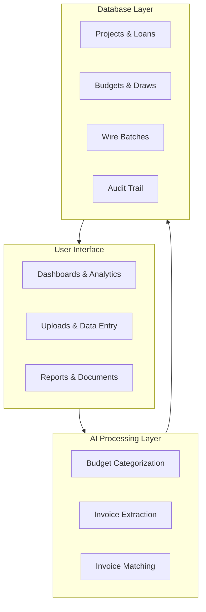
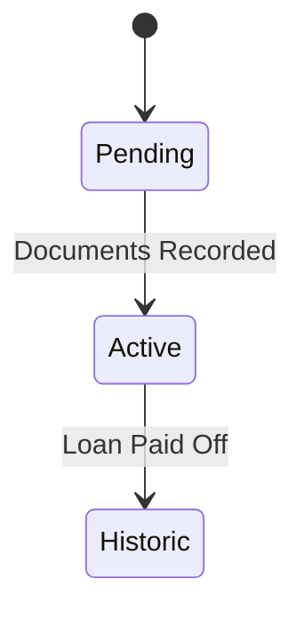
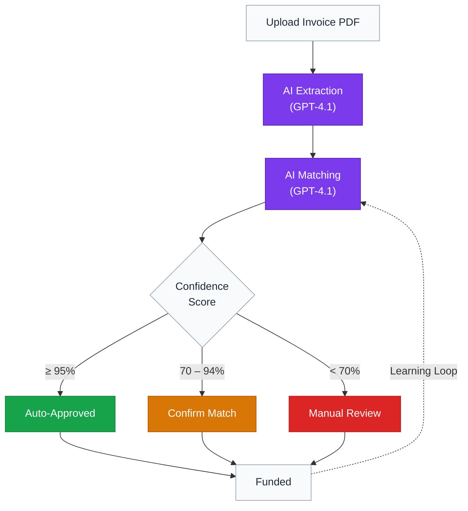

# TD3 Technical Architecture

## Overview

TD3 is a construction loan management platform that replaces fragmented spreadsheet workflows with a unified system for tracking loans, budgets, draws, and wire transfers. The platform combines a modern web interface with AI-powered automation and a secure relational database.

For business context and a high-level workflow overview, see the [README](../README.md).

---

## Table of Contents

1. [Overview](#overview)
2. [System Architecture](#system-architecture)
3. [Core Platform](#core-platform)
4. [AI Integration](#ai-integration)
5. [Security Model](#security-model)
6. [Data Architecture](#data-architecture)
7. [Deployment](#deployment)
8. [Related Documentation](#related-documentation)

---

## System Architecture

The system is organized into three layers:

- **User Interface** -- A server-rendered web application with client-side interactivity. Users interact with dashboards for portfolio management, upload forms for importing budgets and invoices, and polymorphic report views that present data as tables, charts, or formatted documents.

- **AI Processing Layer** -- An external automation engine handles computationally intensive tasks: categorizing budget line items against standardized cost codes, extracting structured data from uploaded invoice PDFs, and matching invoices to draw request lines with confidence scoring. For a detailed breakdown of each AI capability, see [Artificial Intelligence in TD3](ARTIFICIAL_INTELLIGENCE.md).

- **Database Layer** -- A managed relational database with row-level security stores all business data. Every entity change is recorded in an immutable audit trail, ensuring complete traceability of financial transactions.

---

## Core Platform

### Loan Lifecycle Management

Every construction loan progresses through three stages:

- **Pending** -- Loan origination. Term sheet fields are entered, the builder and lender are linked, and documents are prepared for execution.
- **Active** -- The loan is funded and in progress. Budgets are tracked, draws are processed, and the amortization schedule accrues interest in real time.
- **Historic** -- The loan has been paid off. All data is preserved as an immutable record for performance analysis and auditing.

The platform supports multiple builders and lenders, with each loan linking to a builder entity that carries banking information for wire transfers.

### Budget Intelligence

When a builder submits a budget spreadsheet, the system automatically detects column headers and row boundaries, then sends each line item to the AI processing layer for categorization against TD3's standardized cost code system.

TD3 uses a proprietary cost code framework inspired by the National Association of Home Builders (NAHB). The system organizes all construction costs into **12 parent categories** with **89 subcategories**, covering every phase of residential construction from pre-build expenses through final landscaping. Categories are numbered in 100-point increments and follow the chronological order of construction---the sequence a typical residential build progresses through from groundbreaking to completion.

This standardization is what makes cross-project comparison, builder performance tracking, and portfolio-level analytics possible. Every builder's unique naming conventions are mapped to a single canonical structure.

Users review and adjust AI-suggested categories through cascading dropdowns before approving the budget. Once draws are funded against a budget line, that line is protected from deletion during re-imports.

> For details on the cost code system, AI model selection, and confidence scoring, see [Budget Standardization](ARTIFICIAL_INTELLIGENCE.md#budget-standardization).

### Draw Processing Workflow

Draw requests follow a structured workflow:

1. **Upload** -- The draw spreadsheet is imported and individual line items are created.
2. **AI Match & Validate** -- Each line item is fuzzy-matched to the corresponding budget category. Validation flags are generated for issues such as over-budget requests, missing invoices, or unmatched categories.
3. **Review & Approve** -- A processor reviews flagged items, adjusts amounts, and approves the draw.
4. **Stage for Funding** -- Approved draws are grouped by builder into wire batches.
5. **Wire Batch** -- The batch is sent to the bookkeeper for wire processing with a detailed funding report.
6. **Funded** -- Once the wire is confirmed, budget spent amounts are atomically updated and the draw is locked as an immutable record.

> For details on how AI handles invoice matching during the validation step, see [Invoice-to-Budget Matching](ARTIFICIAL_INTELLIGENCE.md#invoice-to-budget-matching).

### Wire Batch Funding

Wire batches consolidate multiple draws for the same builder into a single wire transfer. This reduces banking fees and simplifies bookkeeping. Each batch includes:

- A funding report with per-draw breakdowns
- Builder banking information for the wire
- Status tracking from creation through confirmation
- Complete audit trail of all actions

### Invoice Matching

The invoice system uses a two-stage AI pipeline to process uploaded invoices:

1. **AI Extraction** -- Invoice PDFs are sent to the AI processing layer, which extracts vendor name, amount, description, trade classification, and other structured data from the unstructured document.
2. **AI Matching** -- The extracted data is evaluated against all open draw request lines using semantic reasoning about construction terminology, trade alignment, amount similarity, and vendor history. A confidence score determines whether the match is applied automatically, presented for quick confirmation, or routed to full manual review.

Every match decision---automatic or manual---is recorded for auditing, and approved matches feed into a learning system that improves future accuracy.

> For the complete invoice matching system, including the confidence-gated automation tiers, semantic reasoning approach, and review experience, see [Artificial Intelligence: Invoice-to-Budget Matching](ARTIFICIAL_INTELLIGENCE.md#invoice-to-budget-matching).

The complete invoice processing pipeline from upload through funding:

---

## AI Integration

TD3 integrates artificial intelligence at three critical points in the construction loan servicing workflow:

- **Budget Categorization** -- Mapping builder-specific line items to TD3's standardized cost codes with confidence scoring. See [Budget Standardization](ARTIFICIAL_INTELLIGENCE.md#budget-standardization).
- **Invoice Extraction** -- Converting unstructured invoice PDFs into structured data records the system can reason about. See [Invoice Data Extraction](ARTIFICIAL_INTELLIGENCE.md#invoice-data-extraction).
- **Invoice Matching** -- Evaluating extracted invoice data against draw request lines using multi-factor semantic reasoning. See [Invoice-to-Budget Matching](ARTIFICIAL_INTELLIGENCE.md#invoice-to-budget-matching).

The guiding principle: **AI handles pattern matching and data extraction; humans retain decision authority.** Every AI decision is confidence-scored, auditable, and subject to human review. Nothing is funded without a person in the loop.

For the full AI reference---including model selection rationale, confidence thresholds, the training data pipeline, and the self-improvement roadmap---see [Artificial Intelligence in TD3](ARTIFICIAL_INTELLIGENCE.md).

---

## Security Model

TD3's comprehensive security architecture is documented in the dedicated [Security](SECURITY.md#overview) guide, covering authentication, the four-capability permission model, data-level enforcement, audit trail, AI security guardrails, and infrastructure security.

The interface adapts to each user's permission set---controls and actions that a user cannot perform are hidden rather than disabled, keeping the experience clean and focused. For details on role-adaptive design patterns, see the [Design Language: Polymorphic Behaviors](DESIGN_LANGUAGE.md#7-polymorphic-behaviors).

---

## Data Architecture

The data model centers on **Projects**---each representing a single construction loan. A project links to a **Builder** (the contractor performing the work) and a **Lender** (the institution funding the loan). Builders carry banking information used for wire transfers.

Each project has a set of **Budgets**: categorized line items that define the expected cost structure of the build, organized against TD3's standardized cost codes. Budgets track original amounts, current approved amounts, and amounts already funded.

When a builder requests funds, they submit a **Draw Request** containing individual line items. Each draw line maps to a budget category, and the system validates that the requested amount does not exceed the budget's remaining balance. **Invoices** are uploaded alongside draw requests to support the funding amounts; each invoice is matched to a specific draw line through AI-assisted or manual review.

When draws are approved, they are grouped into **Wire Batches** by builder---consolidating multiple draw requests into a single wire transfer for efficient payment processing. Once a wire batch is confirmed, budget spent amounts are updated atomically and the funded records become immutable.

All user actions flow through a **permissions system** that enforces role-based access at both the application and database layers. Every action is recorded in a comprehensive **audit trail** that provides complete traceability from initial data entry through final funding.

---

## Deployment

- **Continuous integration** with automated builds and type checking on every push
- **Staging environment** with preview deployments for pre-production testing
- **Production deployments** triggered automatically on merge to the main branch
- **Enterprise-grade hosting** with edge network distribution and automatic scaling
- **Managed database** with automated backups, point-in-time recovery, and connection pooling

---

## Related Documentation

| Document | Contents |
|----------|----------|
| [README](../README.md) | Project overview, workflow summary, and documentation index |
| [Artificial Intelligence](ARTIFICIAL_INTELLIGENCE.md) | AI pipeline, cost code system, confidence model, and training data |
| [Security](SECURITY.md) | Authentication, permissions, data-level enforcement, and audit trail |
| [Design Language](DESIGN_LANGUAGE.md) | Design philosophy, color system, polymorphic behaviors, and accessibility |
| [Glossary](GLOSSARY.md) | Definitions of key construction lending, financial, and platform terms |
| [Development Roadmap](ROADMAP.md) | Upcoming features, timeline, and development priorities |

---

*TD3 Technical Architecture -- © 2024-2026 TD3, built by Grayson Graham -- Last updated: February 2026*
