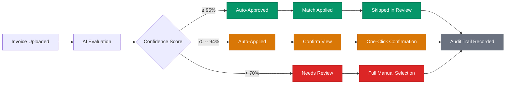

# Artificial Intelligence in TD3

TD3 uses artificial intelligence at three critical points in the construction loan servicing workflow: **budget standardization**, **invoice extraction**, and **invoice matching**. Each addresses a specific bottleneck where manual effort is high, consistency matters, and the consequences of errors are financial.

The guiding principle is straightforward: **AI handles pattern matching and data extraction; humans retain decision authority.** Every AI decision is confidence-scored, auditable, and subject to human review. Nothing is funded without a person in the loop.

---

## Table of Contents

1. [TD3's Standardized Cost Code System](#td3s-standardized-cost-code-system)
2. [Budget Standardization](#budget-standardization)
3. [Invoice Data Extraction](#invoice-data-extraction)
4. [Invoice-to-Budget Matching](#invoice-to-budget-matching)
5. [Training Data and the Path to Self-Improvement](#training-data-and-the-path-to-self-improvement)
6. [Confidence and Trust](#confidence-and-trust)
7. [AI Models: Selection Rationale](#ai-models-selection-rationale)
8. [Related Documentation](#related-documentation)

---

## TD3's Standardized Cost Code System

Effective AI depends on structured data---and in construction finance, that starts with a universal language for costs.

TD3 uses a proprietary cost code system inspired by the National Association of Home Builders (NAHB) framework. The system organizes all construction costs into **12 parent categories** with **89 subcategories**, covering every phase of residential construction from pre-build expenses through final landscaping.

### The 12 Parent Categories

| Code | Category | Construction Phase |
|------|----------|--------------------|
| 0000 | Builder Expense | Pre-construction costs (not fundable) |
| 0100 | General Conditions | Project-wide overhead and site setup |
| 0200 | Site Work | Grading, excavation, utilities |
| 0300 | Concrete & Foundations | Foundation, flatwork, structural concrete |
| 0400 | Framing | Structural framing and trusses |
| 0500 | Exterior Finishes | Roofing, siding, windows, doors |
| 0600 | Plumbing | Rough and finish plumbing |
| 0700 | HVAC / Mechanical | Heating, cooling, ventilation systems |
| 0800 | Electrical | Rough and finish electrical, fixtures |
| 0900 | Insulation / Drywall / Paint | Thermal envelope and interior surfaces |
| 1000 | Interior Finishes | Cabinetry, flooring, trim, fixtures |
| 1100 | Landscaping & Exterior Amenities | Hardscape, softscape, outdoor structures |

Categories are numbered in **100-point increments** (0000, 0100, 0200, ..., 1100) and follow the **chronological order of construction**---the sequence a typical residential build progresses through from groundbreaking to completion. Subcategory codes use the parent code plus an offset (e.g., 0105, 0205, 0305), grouping related line items under their parent trade.

### Why Standardization Matters

Every builder submits budgets using their own naming conventions. One builder's "Mechanical Rough-in" is another's "HVAC Labor - Phase 1." Without standardization, comparing costs across projects is impossible.

TD3's cost code system solves this by mapping every builder's terminology to a single canonical structure. This standardization is what makes the platform's analytical capabilities possible:

- **Cross-loan comparison** --- Compare budget allocations and actual spend across different projects, even when builders use completely different naming conventions.
- **Builder performance tracking** --- Identify which builders consistently come in under or over budget on specific cost categories, measured against industry benchmarks.
- **Predictive analytics** --- Use historical data from completed loans to forecast costs and flag anomalies on new projects before they become problems.
- **Portfolio-level intelligence** --- Aggregate spending patterns across the entire portfolio to identify trends, seasonal variations, and concentration risks.

Builder Expense items (code 0000) are tracked for completeness but are **not fundable**---they represent the builder's own costs that flow through the project but are not reimbursed through the construction loan.

---

## Budget Standardization

### The Problem

When a builder submits a budget spreadsheet, the line items arrive in the builder's own format---custom category names, varying levels of detail, inconsistent terminology. A single HVAC line might be labeled "Mechanical," "Heating & AC," "HVAC Rough + Finish," or simply "Temp Control" depending on the builder.

Manually classifying each line item to the correct cost code is tedious, error-prone, and time-consuming. Multiply this across dozens of active loans, each with 30-80 budget lines, and the operational cost is significant.

### The Solution

When a budget spreadsheet is uploaded, TD3 automatically detects column headers and row boundaries, then sends each line item to an AI model for classification against the 89 subcategories in TD3's cost code system.

**AI Model: GPT-4o** --- Selected for its strong reasoning about ambiguous construction terminology. Budget categorization requires understanding that "Hardy Board Install" means exterior siding, that "Soils Work" maps to site preparation, and that "T&M Electrical" is a time-and-materials electrical contract. GPT-4o's ability to reason through these associations---often requiring multi-step inference about construction processes---makes it the right choice for this task.

### How It Works

1. **Upload** --- The builder's budget spreadsheet is uploaded to TD3. The system automatically parses the file, identifying line item descriptions and amounts.

2. **AI Classification** --- Each line item is sent to the AI processing layer with the full list of available subcategories. The AI evaluates the description, considers construction context, and selects the most appropriate subcategory with a confidence score.

3. **Human Review** --- A loan processor reviews the AI's suggestions through cascading dropdown menus (parent category, then subcategory). High-confidence matches appear pre-selected; lower-confidence items are flagged for closer attention. The processor can accept or override any suggestion.

4. **Protection After Funding** --- Once a draw has been funded against a budget line, that line is locked against deletion during re-imports. This prevents accidental loss of funded budget categories if a builder submits an updated spreadsheet.

### Confidence Scoring

Every AI classification includes a confidence score reflecting the model's certainty. Higher confidence means a clearer mapping between the builder's terminology and a specific cost code. Lower confidence typically indicates ambiguous descriptions that could map to multiple categories---these are prioritized for human review.

---

## Invoice Data Extraction

### The Problem

Construction invoices arrive in wildly varying formats. A plumbing subcontractor's invoice looks nothing like a lumber supplier's. Some are typed, some are handwritten. Some include detailed line items; others show only a single total. Font sizes, layouts, logo placements, and terminology differ across every vendor.

Manually reading each invoice, identifying the vendor, extracting the total amount, and noting the type of work performed is repetitive work that scales linearly with draw volume.

### The Solution

When invoice PDFs are uploaded alongside a draw request, TD3 sends each file to an AI model that reads the document and extracts structured data---converting an unstructured PDF into a clean data record the system can reason about.

**AI Model: GPT-4.1-mini** --- Selected for its optimization in document parsing tasks. Invoice extraction is high-volume work (every draw request may include dozens of invoices) where speed and cost-effectiveness matter. GPT-4.1-mini delivers fast, accurate extraction at a fraction of the cost of larger models, making it practical to process invoices at scale without compromising quality.

### What Gets Extracted

From each invoice PDF, the AI extracts:

| Field | Description | Example |
|-------|-------------|---------|
| **Vendor Name** | The company or individual who issued the invoice | Deschutes Heating & Cooling |
| **Amount** | Total invoice amount | $25,660.00 |
| **Invoice Number** | The vendor's invoice identifier | INV-2026-0847 |
| **Invoice Date** | Date the invoice was issued | January 15, 2026 |
| **Line Items Summary** | Concatenated descriptions of all line items on the invoice | Furnace installation; Ductwork rough-in; Air handler mounting |
| **Trade Classification** | The construction trade the work falls under | HVAC |
| **Work Context** | A natural-language summary of the work performed, including construction-specific terminology | HVAC rough-in and finish work including ductwork installation, furnace setup, and air handler mounting for new residential construction |
| **Work Type** | Whether the invoice covers labor, materials, equipment, or a mix | Mixed |
| **Vendor Type** | Whether the vendor is a subcontractor, supplier, utility, or professional service | Subcontractor |
| **Keywords** | Normalized terms describing the work, used for downstream matching | hvac, heating, cooling, ductwork, mechanical, furnace |

### Quality Safeguards

The extraction process includes built-in sanity checks. For example, invoices with unusually low amounts (under $50 from non-utility vendors) are flagged as suspicious---a signal that the AI may have misread the document or that the invoice requires closer human attention before matching.

Extraction confidence is scored separately from matching confidence. A perfectly extracted invoice may still be difficult to match to the correct budget line if the draw request has multiple similar categories.

### Asynchronous Processing

Invoice extraction and matching run asynchronously---the user uploads files and continues working while AI processes them in the background. The interface provides real-time status updates, showing which invoices are being extracted, which are being matched, and which are ready for review. This design ensures that AI processing time never blocks the user's workflow, even when a draw request includes a large batch of invoices.

---

## Invoice-to-Budget Matching

### The Problem

After extraction, each invoice needs to be matched to the correct budget line on the draw request. This is the most intellectually demanding step in the process. The matcher must consider:

- Does the vendor's trade align with the budget category?
- Is the invoice amount consistent with the draw line amount?
- Could this invoice apply to more than one budget line?
- Has this budget line already received a matched invoice?
- Does the work description make sense for the category?

A human performing this task must hold multiple data points in working memory and make judgment calls on ambiguous cases. With 10-15 invoices per draw and 30-80 budget lines per project, the combinatorial complexity adds up quickly.

### The Solution

TD3 sends the extracted invoice data---along with the complete set of draw request lines and their budget context---to an AI model that evaluates all possible matches and selects the best one. The AI sees every candidate simultaneously, weighing multiple factors to make a holistic decision.

**AI Model: GPT-5-mini** --- Selected for its superior multi-factor reasoning capability. Unlike extraction (which is primarily document parsing), matching requires weighing trade alignment, amount similarity, work context, vendor history, and dedup status simultaneously. GPT-5-mini's advanced reasoning makes it significantly more accurate on ambiguous cases where multiple budget lines could plausibly match an invoice.

### Matching Process

1. **Enrichment** --- Each draw request line is enriched with its full budget context: the standardized cost code, parent NAHB category, subcategory name, original builder category name, total budget amount, amount already spent, and remaining balance. Lines that already have a matched invoice are marked with the existing match amount.

2. **AI Evaluation** --- The AI receives the extracted invoice data and all enriched draw lines. It evaluates the match holistically, reasoning from the vendor name, line item descriptions, work context, trade classification, and amount relationships. There is no rigid mapping table---the AI uses semantic understanding of construction terminology.

3. **Confidence Scoring** --- The AI returns a confidence score, the selected draw line, a natural-language explanation of its reasoning, and the factors that influenced its decision. This transparency is critical for human reviewers who need to understand not just *what* the AI chose, but *why*.

4. **Duplicate Protection** --- Before applying a match, the system checks whether the target draw line already has an invoice. If another invoice was matched to the same line during processing, the system evaluates whether the amounts represent a legitimate split (two invoices covering different portions of the same budget line) or a conflict that requires human review.

### Confidence-Gated Automation

Not all matches are treated equally. TD3 uses a three-tier confidence system that calibrates human involvement to the AI's certainty:

| Confidence Level | Threshold | Behavior | Human Effort |
|------------------|-----------|----------|--------------|
| **Auto-Approved** | 95% or higher | Match applied automatically; skipped in review queue | None required |
| **Auto-Applied, Confirm** | 70% -- 94% | Match applied and shown in a simplified confirmation view | One-click confirmation or reassignment |
| **Needs Review** | Below 70% | AI suggestion stored but not applied; full manual selection required | Full category review with AI suggestion visible |

This tiered approach means human attention is focused where it matters most. High-confidence matches (typically straightforward vendor-to-category alignments) flow through automatically. Moderate-confidence matches need only a quick confirmation. Only genuinely ambiguous cases require full manual review---and even then, the AI's suggestion and reasoning are visible to guide the reviewer.

The confidence-gated decision flow:



### Semantic Matching: How the AI Reasons

The matching AI does not rely on rigid lookup tables or hardcoded trade-to-category mappings. Instead, it uses **semantic reasoning** about construction terminology---the same kind of contextual understanding an experienced loan processor develops over years of reviewing invoices.

For example, when the AI sees an invoice from "Pacific Insulation Supply" with line items mentioning "R-38 blown-in attic insulation" and "vapor barrier installation," it doesn't simply look up "insulation" in a mapping table. It considers:

- The vendor name strongly suggests insulation materials
- The line items describe specific insulation products and installation methods
- The work context aligns with the thermal envelope phase of construction
- The amount is consistent with insulation scope on similar-sized projects

This semantic approach is more robust than rule-based matching because it handles the real-world variation in how construction work is described. A vendor named "Mountain View Builders Supply" selling insulation wouldn't match on vendor name alone---but the line item descriptions and work context still point clearly to the correct budget category.

### The Review Experience

When human review is needed, the system presents a guided sequential flow. Invoices are prioritized by urgency: items needing full review appear first, followed by items needing confirmation. The reviewer sees the invoice PDF alongside the AI's suggestion, confidence score, and reasoning. Keyboard shortcuts enable rapid navigation between invoices.

For each invoice in the review queue, the reviewer has full context:

- **Side-by-side view** --- The original invoice PDF is displayed alongside the matching interface, so the reviewer can verify details without switching between screens.
- **AI reasoning** --- The model's explanation of why it selected a particular budget line, including the specific factors it weighed (trade alignment, amount similarity, work context).
- **Confidence indicator** --- A color-coded score that immediately signals whether the match is strong (green), moderate (amber), or weak (red).
- **All candidates** --- The complete list of draw lines grouped by cost code category, so the reviewer can quickly select an alternative if the AI's suggestion is incorrect.

For confirmed and corrected matches alike, every decision is recorded: who made it, when, what the AI originally suggested, and whether the human agreed or overrode the recommendation.

---

## Training Data and the Path to Self-Improvement

### What TD3 Captures Today

Every match decision---whether made by AI or corrected by a human---feeds into a learning system that grows more valuable over time. When a draw is funded (the final seal of approval on all its matches), TD3 captures structured training data for each invoice:

- **Vendor-to-category associations** --- Which vendors consistently map to which cost codes, strengthened with every confirmed match.
- **AI vs. human decisions** --- Whether the AI's original suggestion was accepted or overridden, and what the human selected instead.
- **Confidence calibration data** --- The AI's confidence at match time compared to the final outcome, enabling future threshold refinement.
- **Amount patterns** --- Typical invoice amounts for each vendor and category combination, establishing baselines for anomaly detection.
- **Match method** --- Whether the final match was automatic, AI-selected, or manually assigned, providing signal about which types of invoices the AI handles well and where it struggles.

### Vendor Intelligence

Over time, the system builds a comprehensive map of vendor-to-category relationships. When a vendor like "Deschutes Heating & Cooling" is matched to HVAC categories across multiple projects, that association becomes stronger. The next time the same vendor appears on a new project, the system already has historical context that reinforces the AI's decision.

Each vendor association tracks:

- **Match count** --- How many times this vendor has been matched to this cost code category, providing a frequency-based confidence signal.
- **Cumulative amount** --- The total dollar value of invoices matched, distinguishing between a vendor's primary trade (high volume) and occasional one-off work.
- **Recency** --- When the most recent match occurred, ensuring that stale associations don't override current evidence.

This vendor intelligence is particularly valuable for construction lending, where the same subcontractors and suppliers appear repeatedly across a builder's projects. A regional HVAC company that appears on every project from a given builder becomes a near-certain match after the first few loans.

### What's Coming

The training data being captured today is the foundation for a self-improving matching system:

- **Historical context in AI prompts** --- Past vendor-to-category associations and match outcomes will be included as few-shot examples in the matching prompt, giving the AI concrete evidence of how similar invoices were handled before.
- **Confidence calibration** --- Tracking actual accuracy versus reported confidence over time will enable threshold refinement---if the AI reports 85% confidence but is correct 97% of the time for a given vendor, the effective threshold can be adjusted.
- **Correction-driven learning** --- Human overrides are the most valuable training signal. When a reviewer changes an AI match, the system learns not just the correct answer but the type of mistake the AI made, enabling targeted prompt improvements.

The goal is a virtuous cycle: more funded draws produce more training data, which produces more accurate matching, which requires less human intervention, which allows the team to handle greater volume without adding headcount.

### The Self-Improvement Loop

```
Invoices uploaded and matched (AI + human review)
    |
    v
Draw funded --- training data captured
    |
    v
Vendor associations strengthened, correction patterns recorded
    |
    v
Next invoice from same vendor benefits from historical context
    |
    v
Higher confidence, less human intervention
    |
    v
More invoices processed per hour, more training data generated
```

This feedback loop is a compounding advantage. Early loans require more human review as the system builds its knowledge base. Over time, as vendor associations accumulate and the AI's prompts incorporate richer historical context, the ratio of auto-approved to manually-reviewed invoices shifts steadily in favor of automation.

---

## Confidence and Trust

TD3's AI system is built on a three-layer trust model that ensures accuracy while maintaining operational efficiency.

### Layer 1: AI Confidence Scoring

Every AI decision includes a numerical confidence score that reflects the model's certainty. These scores drive automation thresholds and determine the level of human involvement required. The interface uses color-coded indicators---green for high confidence, amber for moderate, red for low---so reviewers can immediately identify where attention is needed. See the [Design Language](DESIGN_LANGUAGE.md) for the full confidence color system.

### Layer 2: Human Oversight

AI never operates without a safety net. Budget categorizations are reviewed through interactive dropdowns before approval. Invoice matches are gated by confidence thresholds that route uncertain decisions to human reviewers. Funded budget lines are protected from modification. The system is designed so that the cost of AI errors is bounded---mistakes are caught before they reach the funding stage.

### Layer 3: Complete Audit Trail

Every AI decision, human review, and correction is permanently recorded. The audit trail captures what the AI suggested, what confidence it reported, whether a human agreed or overrode the recommendation, and the final outcome. This record serves three purposes:

1. **Compliance** --- Regulators and auditors can trace any funded amount back through the complete decision chain.
2. **Accountability** --- Every match can be attributed to either an AI decision or a specific human reviewer.
3. **Improvement** --- The historical record provides the data needed to calibrate confidence thresholds, identify systematic AI errors, and measure accuracy improvements over time.

For details on how the audit trail integrates with the broader security model, see [Security](SECURITY.md).

### Why Three Layers Matter

Any single trust mechanism has failure modes. AI confidence can be miscalibrated. Human reviewers can make mistakes under time pressure. Audit trails are only useful after the fact. By combining all three, TD3 creates defense in depth:

- If the AI is wrong but confident, the audit trail catches the pattern over time and enables threshold recalibration.
- If a human reviewer approves an incorrect match, the audit trail attributes the decision and surfaces it during compliance reviews.
- If confidence scoring is systematically off for certain invoice types, the historical accuracy data reveals the gap.

No single layer needs to be perfect. Together, they provide the assurance required for financial decision-making.

---

## AI Models: Selection Rationale

TD3 uses three different AI models, each selected for the specific demands of its task:

| Task | Model | Why This Model |
|------|-------|----------------|
| **Budget Categorization** | GPT-4o | Requires deep reasoning about ambiguous construction terminology and multi-step inference. Classification quality is paramount---errors here propagate to every downstream process. |
| **Invoice Extraction** | GPT-4.1-mini | High-volume document parsing where speed and cost-effectiveness matter. Each draw may include dozens of invoices. Extraction is pattern recognition, not complex reasoning. |
| **Invoice Matching** | GPT-5-mini | Multi-factor decision-making that weighs trade alignment, amounts, work context, vendor history, and dedup status simultaneously. Superior reasoning accuracy on ambiguous cases. |

The model selection reflects a deliberate cost-accuracy tradeoff: the most capable (and expensive) models are used where reasoning complexity is highest, while faster, more efficient models handle high-volume pattern recognition tasks.

---

## Related Documentation

| Document | Contents |
|----------|----------|
| [Technical Architecture](ARCHITECTURE.md) | System architecture, data model, and deployment |
| [Security](SECURITY.md) | Authentication, permissions, data-level enforcement, and audit trail |
| [Development Roadmap](ROADMAP.md) | Upcoming features, timeline, and development priorities |
| [Design Language](DESIGN_LANGUAGE.md) | Design philosophy, color system, polymorphic behaviors, and accessibility |
| [Glossary](GLOSSARY.md) | Definitions of key construction lending, financial, and platform terms |
| [README](../README.md) | Project overview, workflow summary, and documentation index |

---

*TD3 Artificial Intelligence -- © 2024-2026 TD3, built by Grayson Graham -- Last updated: February 2026*
