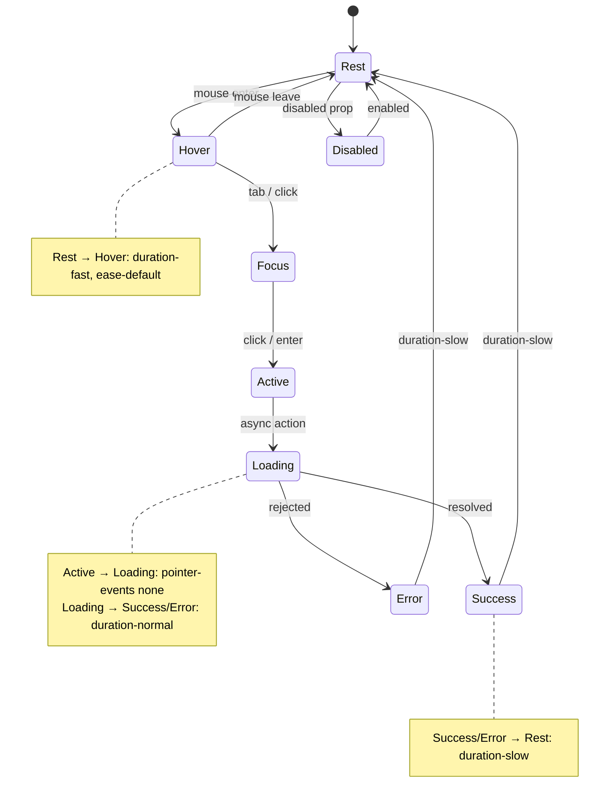

# TD3 Design Language System

> A sophisticated design system combining **Material Design** principles with **Polymorphic UI** adaptability for the TD3 Construction Draw Management platform.

---

## Table of Contents

1. [Design Philosophy](#1-design-philosophy)
2. [Color System](#2-color-system)
3. [Typography](#3-typography)
4. [Spacing & Layout](#4-spacing--layout)
5. [Elevation & Shadows](#5-elevation--shadows)
6. [Motion & Animation](#6-motion--animation)
7. [Polymorphic Behaviors](#7-polymorphic-behaviors)
8. [Component Specifications](#8-component-specifications)
9. [Accessibility](#9-accessibility)
10. [Implementation Guide](#10-implementation-guide)

---

## 1. Design Philosophy

### 1.1 Core Principles

TD3's design language merges two powerful paradigms:

#### Material Foundation
> *"Digital surfaces that behave like physical materials"*

- **Tactile Realism** — Surfaces have depth, weight, and respond to interaction
- **Elevation Hierarchy** — Shadows communicate spatial relationships
- **Meaningful Motion** — Animations provide continuity and feedback
- **Grid Consistency** — Layouts built on a predictable 4px base unit

#### Polymorphic Intelligence
> *"Interfaces that adapt to context, state, and user needs"*

- **Context-Aware Styling** — Colors and emphasis shift based on content status
- **Emotionally Responsive** — Visual feedback reflects action outcomes
- **Role-Based Adaptation** — Interface emphasis changes per user role
- **Content-Driven Morphing** — Components reshape to fit their data

### 1.2 Design DNA

```
TD3 = Material Depth + Polymorphic Intelligence + Financial Precision
```

The interface should feel:
- **Professional** — Clean, trustworthy, suited for financial workflows
- **Intelligent** — Anticipates needs, surfaces relevant information
- **Responsive** — Every interaction has immediate, satisfying feedback
- **Accessible** — Works for all users in any lighting condition

This document describes the visual language that shapes every screen in TD3. While it includes technical specifications for implementation consistency, the principles and patterns described here directly reflect the user experience. For how these design principles serve the business workflow, see the [README](../README.md).

---

## 2. Color System

### 2.1 Brand Colors

TD3's brand is anchored in a **Dark Red/Maroon** accent that conveys:
- **Authority** — Financial trust and institutional strength
- **Urgency** — Draws attention to important actions
- **Sophistication** — Rich, deep tones for premium feel

#### Primary Accent Scale (Dark Red)

Based on `#950606` with accessibility-optimized variants.

**Note:** The CSS default (`:root`) is dark mode; light mode is applied via the `.light` class. The accent-500 value (`#950606`) is consistent across both modes.

| Token | Light Mode (`.light`) | Dark Mode (`:root`) | Usage |
|-------|------------|-----------|-------|
| `--accent-50` | `#FEF2F2` | `#1A0808` | Subtle backgrounds, glows |
| `--accent-100` | `#FEE2E2` | `#2D1010` | Hover backgrounds |
| `--accent-200` | `#FECACA` | `#451515` | Active backgrounds |
| `--accent-300` | `#FCA5A5` | `#5C1B1B` | Borders, dividers |
| `--accent-400` | `#F87171` | `#7A2020` | Secondary elements |
| `--accent-500` | `#950606` | `#950606` | **Primary accent** |
| `--accent-600` | `#840505` | `#B00808` | Hover state |
| `--accent-700` | `#740505` | `#C41919` | Text on dark backgrounds |
| `--accent-800` | `#530303` | `#D83232` | High contrast text |
| `--accent-900` | `#320202` | `#E85050` | Maximum contrast |

**Additional accent utilities** (defined in CSS):
| Token | Light Mode | Dark Mode | Usage |
|-------|------------|-----------|-------|
| `--accent` | `var(--accent-500)` | `var(--accent-500)` | Shorthand alias |
| `--accent-hover` | `var(--accent-600)` | `var(--accent-600)` | Hover state alias |
| `--accent-glow` | `rgba(149, 6, 6, 0.2)` | `rgba(149, 6, 6, 0.35)` | Glow effects |
| `--accent-muted` | `rgba(149, 6, 6, 0.1)` | `rgba(149, 6, 6, 0.20)` | Muted backgrounds |

**Accessibility Note:** The accent color `#950606` achieves **9.1:1 contrast ratio** on white (AAA). In dark mode, the same `#950606` is used as the primary accent with lighter tints for higher scales.

### 2.2 Neutral Palette

Carefully calibrated for eye comfort in extended use:

#### Light Mode (`.light` class)

| Token | Value | Usage |
|-------|-------|-------|
| `--bg-primary` | `#FFFFFF` | Page background |
| `--bg-secondary` | `#F9FAFB` | Sidebars, headers |
| `--bg-tertiary` | `#F3F4F6` | Nested containers |
| `--bg-card` | `#FFFFFF` | Cards, elevated surfaces |
| `--bg-card-transparent` | `rgba(255, 255, 255, 0.85)` | Translucent card surfaces |
| `--bg-hover` | `#E5E7EB` | Interactive hover states |
| `--bg-active` | `#D1D5DB` | Active/pressed states |
| `--border` | `#D1D5DB` | Prominent borders |
| `--border-subtle` | `#E5E7EB` | Subtle separators |
| `--border-accent` | `var(--accent-500)` | Accent-colored borders |
| `--text-primary` | `#111827` | Primary content |
| `--text-secondary` | `#374151` | Secondary content |
| `--text-muted` | `#6B7280` | Hints, placeholders |
| `--text-disabled` | `#9CA3AF` | Disabled states |
| `--text-inverse` | `#FFFFFF` | Text on accent backgrounds |

#### Dark Mode (`:root` default)

| Token | Value | Usage |
|-------|-------|-------|
| `--bg-primary` | `#151518` | Page background |
| `--bg-secondary` | `#1C1C20` | Sidebars, headers |
| `--bg-tertiary` | `#232328` | Nested containers |
| `--bg-card` | `#1E1E23` | Cards, elevated surfaces |
| `--bg-card-transparent` | `rgba(30, 30, 35, 0.85)` | Translucent card surfaces |
| `--bg-hover` | `#2D2D33` | Interactive hover states |
| `--bg-active` | `#3A3A40` | Active/pressed states |
| `--border` | `#3F3F46` | Prominent borders |
| `--border-subtle` | `#27272A` | Subtle separators |
| `--border-accent` | `var(--accent-400)` | Accent-colored borders |
| `--text-primary` | `#FAFAFA` | Primary content |
| `--text-secondary` | `#A1A1AA` | Secondary content |
| `--text-muted` | `#71717A` | Hints, placeholders |
| `--text-disabled` | `#52525B` | Disabled states |
| `--text-inverse` | `#151518` | Text on accent backgrounds |

### 2.3 Semantic Colors

Context-aware colors that adapt to light/dark modes. Each semantic color has four variants: base, hover, muted (backgrounds), and glow (focus effects).

| Purpose | Light Mode (`.light`) | Dark Mode (`:root`) | Usage |
|---------|------------|-----------|-------|
| Success | `#059669` | `#059669` | Approvals, completions |
| Success Hover | `#047857` | `#10B981` | Hover state |
| Success Muted | `rgba(5, 150, 105, 0.1)` | `rgba(5, 150, 105, 0.15)` | Success badges/backgrounds |
| Success Glow | `rgba(5, 150, 105, 0.2)` | `rgba(5, 150, 105, 0.25)` | Focus ring glow |
| Warning | `#D97706` | `#D97706` | Pending, attention |
| Warning Hover | `#B45309` | `#F59E0B` | Hover state |
| Warning Muted | `rgba(217, 119, 6, 0.1)` | `rgba(217, 119, 6, 0.15)` | Warning badges/backgrounds |
| Warning Glow | `rgba(217, 119, 6, 0.2)` | `rgba(217, 119, 6, 0.25)` | Focus ring glow |
| Error | `#DC2626` | `#DC2626` | Errors, rejections |
| Error Hover | `#B91C1C` | `#EF4444` | Hover state |
| Error Muted | `rgba(220, 38, 38, 0.1)` | `rgba(220, 38, 38, 0.15)` | Error badges/backgrounds |
| Error Glow | `rgba(220, 38, 38, 0.2)` | `rgba(220, 38, 38, 0.25)` | Focus ring glow |
| Info | `#2563EB` | `#2563EB` | Informational states |
| Info Hover | `#1D4ED8` | `#3B82F6` | Hover state |
| Info Muted | `rgba(37, 99, 235, 0.1)` | `rgba(37, 99, 235, 0.15)` | Info badges/backgrounds |
| Info Glow | `rgba(37, 99, 235, 0.2)` | `rgba(37, 99, 235, 0.25)` | Focus ring glow |

### 2.4 Complementary Accent Colors

For data visualization and special emphasis:

| Color | Value | CSS Token | Usage |
|-------|-------|-----------|-------|
| **Teal** | `#0D9488` | `--teal` | Complementary accent, charts |
| **Gold** | `#D97706` | `--gold` | Premium highlights, high-value |
| **Purple** | `#7C3AED` | `--purple` | Wire/processing status, charts |
| **Deep Blue** | `#2563EB` | `--deep-blue` | Secondary charts, depth |

Each complementary color also has a `-muted` variant (e.g., `--teal-muted`) for background tints.

### 2.5 Status-Specific Palettes (Polymorphic)

The interface tints based on workflow status:

| Status | Tint | Application |
|--------|------|-------------|
| **Draft** | Neutral gray | Muted, incomplete feel |
| **Pending Review** | Amber/Gold | Awaiting attention |
| **Staged** | Soft blue | Ready state |
| **Approved** | Green | Positive confirmation |
| **Rejected** | Red | Requires action |
| **Pending Wire** | Purple | Financial processing |
| **Paid/Complete** | Deep green | Final success |

---

## 3. Typography

### 3.1 Font Stack

```css
/* Primary - UI Text */
--font-primary: 'Inter', -apple-system, BlinkMacSystemFont, 'SF Pro Display', system-ui, sans-serif;

/* Monospace - Numbers, Code */
--font-mono: 'JetBrains Mono', 'SF Mono', 'Fira Code', Consolas, monospace;

/* Display - Optional for large headlines */
--font-display: 'Inter', var(--font-primary);
```

**Why Inter?**
- Designed specifically for computer screens
- Excellent legibility at small sizes
- Clear distinction between similar characters (1, l, I)
- Variable font support for precise weight control

### 3.2 Type Scale

Based on a **1.25 ratio** (Major Third) with 16px base:

| Token | Size | Weight | Line Height | Letter Spacing | Usage |
|-------|------|--------|-------------|----------------|-------|
| `--text-xs` | 11px | 400 | 1.5 | 0.02em | Micro labels, timestamps |
| `--text-sm` | 13px | 400 | 1.5 | 0.01em | Secondary text, captions |
| `--text-base` | 16px | 400 | 1.5 | 0 | Body copy, default |
| `--text-lg` | 18px | 500 | 1.4 | -0.01em | Emphasized body |
| `--text-xl` | 20px | 600 | 1.3 | -0.01em | Section headers |
| `--text-2xl` | 24px | 700 | 1.2 | -0.02em | Page titles |
| `--text-3xl` | 30px | 700 | 1.1 | -0.02em | Dashboard headers |
| `--text-4xl` | 36px | 800 | 1.1 | -0.03em | Hero text |

### 3.3 Font Weights

| Weight | Value | Usage |
|--------|-------|-------|
| Regular | 400 | Body text, descriptions |
| Medium | 500 | Labels, emphasized text |
| Semibold | 600 | Buttons, headers |
| Bold | 700 | Titles, key metrics |
| Extrabold | 800 | Display numbers |

### 3.4 Numeric Typography

Financial data uses **tabular figures** for alignment:

```css
.financial-value {
  font-family: var(--font-mono);
  font-variant-numeric: tabular-nums;
  font-feature-settings: 'tnum' on;
}
```

---

## 4. Spacing & Layout

### 4.1 Base Unit

All spacing derives from a **4px base unit**:

| Token | Value | Usage |
|-------|-------|-------|
| `--space-0` | 0px | No spacing |
| `--space-0.5` | 2px | Micro adjustments |
| `--space-1` | 4px | Tight gaps, icon padding |
| `--space-2` | 8px | Related elements |
| `--space-3` | 12px | Component internal padding |
| `--space-4` | 16px | Standard gap |
| `--space-5` | 20px | Card padding |
| `--space-6` | 24px | Section spacing |
| `--space-8` | 32px | Large gaps |
| `--space-10` | 40px | Section dividers |
| `--space-12` | 48px | Page sections |
| `--space-16` | 64px | Major sections |

### 4.2 Border Radius

iOS-inspired rounded corners with consistent proportions:

| Token | Value | Usage |
|-------|-------|-------|
| `--radius-none` | 0px | Sharp corners |
| `--radius-xs` | 4px | Small badges, pills |
| `--radius-sm` | 6px | Buttons, inputs |
| `--radius-md` | 8px | Small cards, dropdowns |
| `--radius-lg` | 12px | Cards, panels |
| `--radius-xl` | 16px | Modals, sheets |
| `--radius-2xl` | 20px | Large containers |
| `--radius-full` | 9999px | Pills, avatars |

### 4.3 Layout Grid

#### Container Widths

| Size | Max Width | Usage |
|------|-----------|-------|
| `--container-sm` | 640px | Narrow content |
| `--container-md` | 768px | Standard content |
| `--container-lg` | 1024px | Wide content |
| `--container-xl` | 1280px | Full layouts |
| `--container-2xl` | 1536px | Maximum width |

#### Column System

- 12-column grid for primary content
- 16px gutters (--space-4)
- Sidebar widths: 256px (16rem) default

---

## 5. Elevation & Shadows

### 5.1 Elevation Scale

Material Design-inspired depth system:

```
┌─────────────────────────────────────────────┐  Level 0: Page canvas
│  ┌───────────────────────────────────────┐  │  Level 1: Sidebars, toolbars
│  │  ┌─────────────────────────────────┐  │  │  Level 2: Cards, panels
│  │  │  ┌───────────────────────────┐  │  │  │  Level 3: Dropdowns, popovers
│  │  │  │  ┌─────────────────────┐  │  │  │  │  Level 4: Modals, sheets
│  │  │  │  │  ┌───────────────┐  │  │  │  │  │  Level 5: Toasts, tooltips
│  │  │  │  │  │               │  │  │  │  │  │
└──┴──┴──┴──┴──┴───────────────┴──┴──┴──┴──┴──┘
```

### 5.2 Shadow Tokens

| Token | Light Mode | Dark Mode |
|-------|------------|-----------|
| `--elevation-0` | none | none |
| `--elevation-1` | `0 1px 2px rgba(0,0,0,0.05)` | `0 1px 2px rgba(0,0,0,0.3)` |
| `--elevation-2` | `0 1px 3px rgba(0,0,0,0.1), 0 1px 2px rgba(0,0,0,0.06)` | `0 1px 3px rgba(0,0,0,0.4), 0 1px 2px rgba(0,0,0,0.3)` |
| `--elevation-3` | `0 4px 6px rgba(0,0,0,0.1), 0 2px 4px rgba(0,0,0,0.06)` | `0 4px 6px rgba(0,0,0,0.5), 0 2px 4px rgba(0,0,0,0.3)` |
| `--elevation-4` | `0 10px 15px rgba(0,0,0,0.1), 0 4px 6px rgba(0,0,0,0.05)` | `0 10px 15px rgba(0,0,0,0.6), 0 4px 6px rgba(0,0,0,0.3)` |
| `--elevation-5` | `0 20px 25px rgba(0,0,0,0.15), 0 8px 10px rgba(0,0,0,0.08)` | `0 20px 25px rgba(0,0,0,0.7), 0 8px 10px rgba(0,0,0,0.4)` |

### 5.3 Glow Effects

Glow effects are constructed using the semantic `--*-glow` tokens rather than standalone custom properties. Each semantic color provides a glow variant:

```css
/* Accent glow - used in button hover, card interactive hover */
--accent-glow: rgba(149, 6, 6, 0.2);     /* Light mode */
--accent-glow: rgba(149, 6, 6, 0.35);    /* Dark mode */

/* Semantic glow tokens */
--success-glow: rgba(5, 150, 105, 0.2);  /* Light */ / rgba(5, 150, 105, 0.25);  /* Dark */
--error-glow: rgba(220, 38, 38, 0.2);    /* Light */ / rgba(220, 38, 38, 0.25);  /* Dark */
--warning-glow: rgba(217, 119, 6, 0.2);  /* Light */ / rgba(217, 119, 6, 0.25);  /* Dark */
--info-glow: rgba(37, 99, 235, 0.2);     /* Light */ / rgba(37, 99, 235, 0.25);  /* Dark */
```

### 5.4 Surface Treatments

| Surface | Background | Border | Shadow | Usage |
|---------|------------|--------|--------|-------|
| **Page** | `--bg-primary` | none | none | Base canvas |
| **Panel** | `--bg-secondary` | `--border-subtle` | `--elevation-1` | Sidebars, headers |
| **Card** | `--bg-card` | `--border-subtle` | `--elevation-2` | Content containers |
| **Raised** | `--bg-card` | `--border` | `--elevation-3` | Interactive cards |
| **Floating** | `--bg-card` | `--border` | `--elevation-4` | Dropdowns, popovers |
| **Modal** | `--bg-card` | `--border` | `--elevation-5` | Dialogs, sheets |

---

## 6. Motion & Animation

### 6.1 Timing Functions

```css
/* Standard - Most transitions */
--ease-default: cubic-bezier(0.4, 0, 0.2, 1);

/* Decelerate - Elements entering */
--ease-out: cubic-bezier(0, 0, 0.2, 1);

/* Accelerate - Elements exiting */
--ease-in: cubic-bezier(0.4, 0, 1, 1);

/* Overshoot - Playful feedback */
--ease-spring: cubic-bezier(0.34, 1.56, 0.64, 1);

/* Bounce - Success states */
--ease-bounce: cubic-bezier(0.68, -0.55, 0.265, 1.55);
```

### 6.2 Duration Scale

| Token | Value | Usage |
|-------|-------|-------|
| `--duration-instant` | 50ms | Micro-feedback |
| `--duration-fast` | 100ms | Hover states, toggles |
| `--duration-normal` | 200ms | Standard transitions |
| `--duration-slow` | 300ms | Complex animations |
| `--duration-slower` | 400ms | Page transitions |
| `--duration-slowest` | 500ms | Elaborate sequences |

### 6.3 Animation Patterns

#### Micro-interactions

```css
/* Button press */
.btn:active {
  transform: scale(0.97);
  transition: transform var(--duration-fast) var(--ease-spring);
}

/* Hover lift */
.card:hover {
  transform: translateY(-2px);
  box-shadow: var(--elevation-3);
  transition: all var(--duration-normal) var(--ease-out);
}
```

#### State Transitions

```css
/* Fade in */
@keyframes fadeIn {
  from { opacity: 0; }
  to { opacity: 1; }
}

/* Scale in */
@keyframes scaleIn {
  from { transform: scale(0.95); opacity: 0; }
  to { transform: scale(1); opacity: 1; }
}

/* Slide up */
@keyframes slideUp {
  from { transform: translateY(10px); opacity: 0; }
  to { transform: translateY(0); opacity: 1; }
}

/* Shake (error) */
@keyframes shake {
  0%, 100% { transform: translateX(0); }
  20%, 60% { transform: translateX(-4px); }
  40%, 80% { transform: translateX(4px); }
}
```

#### Loading States

```css
/* Skeleton shimmer */
@keyframes shimmer {
  0% { background-position: -200% 0; }
  100% { background-position: 200% 0; }
}

.skeleton {
  background: linear-gradient(
    90deg,
    var(--bg-secondary) 25%,
    var(--bg-hover) 50%,
    var(--bg-secondary) 75%
  );
  background-size: 200% 100%;
  animation: shimmer 1.5s infinite;
}

/* Pulse */
@keyframes pulse {
  0%, 100% { opacity: 1; }
  50% { opacity: 0.5; }
}

/* Spinner */
@keyframes spin {
  from { transform: rotate(0deg); }
  to { transform: rotate(360deg); }
}
```

### 6.4 Reduced Motion

Always respect user preferences:

```css
@media (prefers-reduced-motion: reduce) {
  *,
  *::before,
  *::after {
    animation-duration: 0.01ms !important;
    animation-iteration-count: 1 !important;
    transition-duration: 0.01ms !important;
  }
}
```

---

## 7. Polymorphic Behaviors

### 7.1 Context-Aware Adaptations

The interface shifts appearance based on context:

| Context | Visual Adaptation |
|---------|-------------------|
| **Light/Dark Mode** | Full palette inversion with contrast preservation |
| **Pipeline View** | Cooler tones, analytical feel |
| **Active Loans** | Warmer accent presence, action-oriented |
| **Historic Data** | Muted saturation, archival feel |
| **Error State** | Red tinting, heightened attention |
| **Success State** | Green pulse, celebratory feedback |

### 7.2 Status-Driven Styling

Components adapt based on data status:

```tsx
// Example: Card tints based on status
const statusTints = {
  draft: 'var(--bg-secondary)',
  pending_review: 'rgba(245, 158, 11, 0.08)',
  staged: 'rgba(59, 130, 246, 0.08)',
  approved: 'rgba(16, 185, 129, 0.08)',
  rejected: 'rgba(239, 68, 68, 0.08)',
  pending_wire: 'rgba(139, 92, 246, 0.08)',
  paid: 'rgba(16, 185, 129, 0.12)',
}
```

These status-driven visual cues are central to the [AI confidence system](ARTIFICIAL_INTELLIGENCE.md#confidence-and-trust), where color communicates match certainty.

### 7.3 Emotionally Responsive Feedback

Actions trigger appropriate emotional responses:

| Action | Visual Feedback |
|--------|-----------------|
| **Form Submit** | Button loading state → success pulse |
| **Validation Pass** | Green checkmark slide-in |
| **Validation Fail** | Red shake + persistent indicator |
| **Task Complete** | Celebratory scale-up + confetti (optional) |
| **Data Load** | Skeleton shimmer |
| **Delete** | Fade out + collapse |
| **Undo Available** | Toast with countdown progress |

### 7.4 Amount-Based Emphasis

Financial values receive dynamic emphasis:

| Amount Range | Treatment |
|--------------|-----------|
| < $10,000 | Standard text |
| $10,000 - $100,000 | Medium weight |
| $100,000 - $1,000,000 | Bold + slightly larger |
| > $1,000,000 | Bold + accent color + gold tint |

### 7.5 Role-Based Adaptations (Future)

| Role | Interface Emphasis |
|------|-------------------|
| **Admin** | Full feature access, system controls visible |
| **Lender** | Portfolio focus, approval workflows prominent |
| **Bookkeeper** | Financial data emphasis, wire actions highlighted |
| **Builder** | Draw submission simplified, status tracking central |

See the [Roadmap](ROADMAP.md#builder--lender-portals) for upcoming role-specific interfaces.

---

## 8. Component Specifications

Every interactive component in TD3 follows a consistent state lifecycle. The transitions between states use the motion tokens defined in Section 6:



### 8.1 Buttons

#### Variants

| Variant | Background | Text | Border | Shadow |
|---------|------------|------|--------|--------|
| **Primary** | `--accent-500` | white | none | `--glow-accent` on hover |
| **Secondary** | `--bg-hover` | `--text-primary` | `--border` | `--elevation-1` |
| **Ghost** | transparent | `--accent-500` | none | none |
| **Danger** | `--error` | white | none | error glow on hover |
| **Success** | `--success` | white | none | success glow on hover |

#### States

```css
/* Rest */
.btn { 
  padding: var(--space-2) var(--space-5);
  border-radius: var(--radius-sm);
  font-weight: 600;
  transition: all var(--duration-fast) var(--ease-default);
}

/* Hover */
.btn:hover {
  transform: translateY(-1px);
  box-shadow: var(--elevation-2);
}

/* Active */
.btn:active {
  transform: scale(0.97);
}

/* Disabled */
.btn:disabled {
  opacity: 0.5;
  cursor: not-allowed;
  transform: none;
}

/* Loading */
.btn.loading {
  pointer-events: none;
  opacity: 0.8;
}
```

#### Sizes

| Size | Padding | Font Size | Min Height |
|------|---------|-----------|------------|
| **Small** | `6px 12px` | 13px | 32px |
| **Medium** | `8px 20px` | 14px | 40px |
| **Large** | `12px 24px` | 16px | 48px |

### 8.2 Cards

```css
.card {
  background: var(--bg-card);
  border: 1px solid var(--border-subtle);
  border-radius: var(--radius-lg);
  padding: var(--space-5);
  box-shadow: var(--elevation-2);
  transition: all var(--duration-normal) var(--ease-out);
}

.card:hover {
  border-color: var(--border);
  box-shadow: var(--elevation-3);
  transform: translateY(-2px);
}

.card.interactive:hover {
  border-color: var(--accent-500);
  box-shadow: var(--glow-accent);
}
```

### 8.3 Inputs

```css
.input {
  background: var(--bg-primary);
  border: 2px solid var(--border);
  border-radius: var(--radius-sm);
  padding: var(--space-3) var(--space-4);
  color: var(--text-primary);
  transition: all var(--duration-fast) var(--ease-default);
}

.input::placeholder {
  color: var(--text-muted);
}

.input:hover {
  border-color: var(--text-muted);
}

.input:focus {
  outline: none;
  border-color: var(--accent-500);
  box-shadow: 0 0 0 3px var(--accent-100);
}

.input.error {
  border-color: var(--error);
  box-shadow: 0 0 0 3px rgba(239, 68, 68, 0.15);
}

.input.success {
  border-color: var(--success);
}
```

### 8.4 Badges/Tags

```css
.badge {
  display: inline-flex;
  align-items: center;
  gap: var(--space-1);
  padding: var(--space-1) var(--space-2);
  border-radius: var(--radius-full);
  font-size: var(--text-xs);
  font-weight: 600;
}

/* Status variants */
.badge-draft { 
  background: var(--bg-hover); 
  color: var(--text-secondary); 
}

.badge-pending { 
  background: rgba(245, 158, 11, 0.15); 
  color: #D97706; /* Light */ / #FBBF24; /* Dark */
}

.badge-success { 
  background: rgba(16, 185, 129, 0.15); 
  color: #059669; /* Light */ / #34D399; /* Dark */
}

.badge-error { 
  background: rgba(239, 68, 68, 0.15); 
  color: #DC2626; /* Light */ / #F87171; /* Dark */
}

.badge-accent { 
  background: var(--accent-100); 
  color: var(--accent-600);
}
```

### 8.5 Navigation

#### Header

```css
.header {
  position: fixed;
  top: 0;
  left: 0;
  right: 0;
  height: 56px;
  background: var(--bg-secondary);
  border-bottom: 1px solid var(--border-subtle);
  backdrop-filter: blur(12px);
  z-index: 50;
}
```

#### Sidebar

```css
.sidebar {
  width: 256px;
  height: calc(100vh - 56px);
  background: var(--bg-secondary);
  border-right: 1px solid var(--border-subtle);
  overflow-y: auto;
}

.sidebar-item {
  display: flex;
  align-items: center;
  gap: var(--space-3);
  padding: var(--space-3) var(--space-4);
  border-radius: var(--radius-md);
  color: var(--text-secondary);
  transition: all var(--duration-fast) var(--ease-default);
}

.sidebar-item:hover {
  background: var(--bg-hover);
  color: var(--text-primary);
}

.sidebar-item.active {
  background: var(--accent-100);
  color: var(--accent-600);
}
```

### 8.6 Modals

```css
.modal-overlay {
  position: fixed;
  inset: 0;
  background: rgba(0, 0, 0, 0.6);
  backdrop-filter: blur(4px);
  z-index: 100;
}

.modal {
  position: fixed;
  top: 50%;
  left: 50%;
  transform: translate(-50%, -50%);
  background: var(--bg-card);
  border-radius: var(--radius-xl);
  box-shadow: var(--elevation-5);
  max-width: 90vw;
  max-height: 90vh;
  overflow: hidden;
}

.modal-header {
  padding: var(--space-5);
  border-bottom: 1px solid var(--border-subtle);
}

.modal-body {
  padding: var(--space-5);
  overflow-y: auto;
}

.modal-footer {
  padding: var(--space-4) var(--space-5);
  border-top: 1px solid var(--border-subtle);
  display: flex;
  justify-content: flex-end;
  gap: var(--space-3);
}
```

### 8.7 Tables

```css
.table {
  width: 100%;
  border-collapse: collapse;
}

.table th {
  padding: var(--space-3) var(--space-4);
  text-align: left;
  font-weight: 600;
  font-size: var(--text-sm);
  color: var(--text-secondary);
  background: var(--bg-secondary);
  border-bottom: 1px solid var(--border);
}

.table td {
  padding: var(--space-3) var(--space-4);
  border-bottom: 1px solid var(--border-subtle);
  color: var(--text-primary);
}

.table tr:hover td {
  background: var(--bg-hover);
}

/* Financial columns - right aligned */
.table td.numeric {
  text-align: right;
  font-family: var(--font-mono);
  font-variant-numeric: tabular-nums;
}
```

### 8.8 Progress Indicators

```css
/* Progress Bar */
.progress {
  height: 8px;
  background: var(--bg-hover);
  border-radius: var(--radius-full);
  overflow: hidden;
}

.progress-fill {
  height: 100%;
  background: linear-gradient(90deg, var(--accent-500), var(--accent-600));
  border-radius: var(--radius-full);
  transition: width var(--duration-slow) var(--ease-out);
}

/* Circular Progress */
.progress-circle {
  transform: rotate(-90deg);
}

.progress-circle-track {
  stroke: var(--bg-hover);
}

.progress-circle-fill {
  stroke: var(--accent-500);
  stroke-linecap: round;
  transition: stroke-dashoffset var(--duration-slow) var(--ease-out);
}
```

### 8.9 Toasts/Notifications

```css
.toast {
  display: flex;
  align-items: flex-start;
  gap: var(--space-3);
  padding: var(--space-4);
  background: var(--bg-card);
  border: 1px solid var(--border);
  border-radius: var(--radius-lg);
  box-shadow: var(--elevation-4);
  max-width: 400px;
}

.toast-success {
  border-left: 4px solid var(--success);
}

.toast-error {
  border-left: 4px solid var(--error);
}

.toast-warning {
  border-left: 4px solid var(--warning);
}

.toast-info {
  border-left: 4px solid var(--accent-500);
}
```

---

## 9. Accessibility

### 9.1 Color Contrast Requirements

All color combinations must meet **WCAG 2.1 AA** standards:

| Usage | Minimum Ratio | Target |
|-------|---------------|--------|
| Body text | 4.5:1 | 7:1 (AAA) |
| Large text (18px+) | 3:1 | 4.5:1 |
| UI components | 3:1 | 4.5:1 |
| Focus indicators | 3:1 | 4.5:1 |

### 9.2 Focus States

All interactive elements must have visible focus:

```css
:focus-visible {
  outline: 2px solid var(--accent-500);
  outline-offset: 2px;
}

/* Custom focus ring for buttons */
.btn:focus-visible {
  outline: none;
  box-shadow: 
    0 0 0 2px var(--bg-primary),
    0 0 0 4px var(--accent-500);
}
```

### 9.3 Keyboard Navigation

- All interactive elements must be keyboard accessible
- Tab order follows visual flow
- Modal traps focus appropriately
- Escape closes overlays

### 9.4 Screen Reader Support

- Use semantic HTML elements
- Include ARIA labels where needed
- Announce dynamic content changes
- Provide text alternatives for icons

### 9.5 Touch Targets

Minimum touch target size: **44x44px**

```css
.touch-target {
  min-width: 44px;
  min-height: 44px;
}
```

---

## 10. Implementation Guide

### 10.1 CSS Variables Setup

Defined in the global stylesheet. The default (`:root`) is **dark mode**; light mode is applied via the `.light` class:

```css
:root {
  /* Colors - Dark Mode (Default) */
  --accent-50: #1A0808;
  --accent-100: #2D1010;
  --accent-200: #451515;
  --accent-300: #5C1B1B;
  --accent-400: #7A2020;
  --accent-500: #950606;
  --accent-600: #B00808;
  --accent-700: #C41919;
  --accent-800: #D83232;
  --accent-900: #E85050;

  --accent: var(--accent-500);
  --accent-hover: var(--accent-600);
  --accent-glow: rgba(149, 6, 6, 0.35);
  --accent-muted: rgba(149, 6, 6, 0.20);

  /* ... additional tokens ... */
}

.light {
  /* Colors - Light Mode */
  --accent-50: #FEF2F2;
  --accent-100: #FEE2E2;
  --accent-200: #FECACA;
  --accent-300: #FCA5A5;
  --accent-400: #F87171;
  --accent-500: #950606;
  --accent-600: #840505;
  --accent-700: #740505;
  --accent-800: #530303;
  --accent-900: #320202;

  --accent: var(--accent-500);
  --accent-hover: var(--accent-600);
  --accent-glow: rgba(149, 6, 6, 0.2);
  --accent-muted: rgba(149, 6, 6, 0.1);

  /* ... additional tokens ... */
}
```

### 10.2 Tailwind Configuration

Extended in the Tailwind configuration:

```typescript
const config: Config = {
  theme: {
    extend: {
      colors: {
        accent: {
          50: 'var(--accent-50)',
          100: 'var(--accent-100)',
          // ... etc
          500: 'var(--accent-500)',
          600: 'var(--accent-600)',
          // ... etc
        },
      },
      boxShadow: {
        'elevation-1': 'var(--elevation-1)',
        'elevation-2': 'var(--elevation-2)',
        'elevation-3': 'var(--elevation-3)',
        'elevation-4': 'var(--elevation-4)',
        'elevation-5': 'var(--elevation-5)',
        'glow-accent': 'var(--glow-accent)',
      },
      transitionTimingFunction: {
        'ease-default': 'var(--ease-default)',
        'ease-spring': 'var(--ease-spring)',
      },
    },
  },
}
```

### 10.3 Component Migration Checklist

When updating existing components:

- [ ] Replace hardcoded colors with CSS variables
- [ ] Update shadows to elevation tokens
- [ ] Add proper hover/focus/active states
- [ ] Ensure accessible contrast ratios
- [ ] Add reduced-motion support
- [ ] Test in both light and dark modes

### 10.4 Design Token Files

For larger projects, consider organizing tokens:

```
styles/
├── tokens/
│   ├── colors.css
│   ├── typography.css
│   ├── spacing.css
│   ├── elevation.css
│   └── motion.css
└── globals.css (imports all tokens)
```

---

## Appendix A: Color Reference Card

### Dark Red Accent

| Hex | Usage |
|-----|-------|
| `#FEF2F2` | Lightest tint |
| `#950606` | Primary (light mode) |
| `#DC2626` | Primary (dark mode) |
| `#320202` | Darkest shade |

### Complementary Colors

| Hex | Usage |
|-----|-------|
| `#0D9488` | Teal (complementary) |
| `#D97706` | Gold (premium) |
| `#7C3AED` | Purple (wire/processing) |
| `#2563EB` | Deep Blue (depth) |

---

## Appendix B: Quick Reference

### Shadows Cheatsheet

```css
/* Cards at rest */      box-shadow: var(--elevation-2);
/* Cards on hover */     box-shadow: var(--elevation-3);
/* Dropdowns */          box-shadow: var(--elevation-4);
/* Modals */             box-shadow: var(--elevation-5);
/* Accent glow */        box-shadow: var(--glow-accent);
```

### Spacing Cheatsheet

```css
/* Tight */     gap: var(--space-2);    /* 8px */
/* Standard */  gap: var(--space-4);    /* 16px */
/* Spacious */  gap: var(--space-6);    /* 24px */
/* Section */   gap: var(--space-8);    /* 32px */
```

### Transition Cheatsheet

```css
/* Quick hover */    transition: all var(--duration-fast) var(--ease-default);
/* Standard */       transition: all var(--duration-normal) var(--ease-default);
/* Smooth entry */   transition: all var(--duration-slow) var(--ease-out);
/* Bouncy */         transition: all var(--duration-normal) var(--ease-spring);
```

---

## Related Documentation

| Document | Description |
|----------|-------------|
| [README](../README.md) | Platform overview, business context, and workflow summary |
| [Technical Architecture](ARCHITECTURE.md) | System architecture, data flow, and security model |
| [Artificial Intelligence](ARTIFICIAL_INTELLIGENCE.md) | AI models, cost code system, confidence scoring, and training data |
| [Development Roadmap](ROADMAP.md) | Upcoming features, AI enhancements, and development timeline |

### Upcoming Design Work

See the [Development Roadmap](ROADMAP.md) for detailed timelines on features that will require new design patterns:

- **Builder Portal** — Simplified interface for external builders to view loans and submit draws
- **Lender Portal** — Read-only portfolio view for lending partners
- **Mobile Inspection App** — Touch-optimized interface for field inspections and photo capture

---

*TD3 Design Language v1.2 -- © 2024-2026 TD3, built by Grayson Graham -- Last updated: February 2026*

