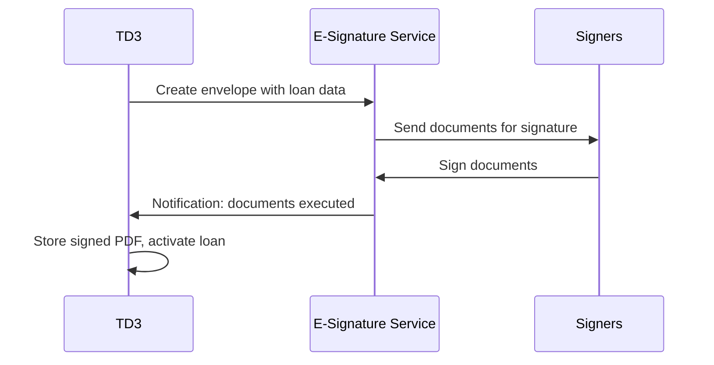
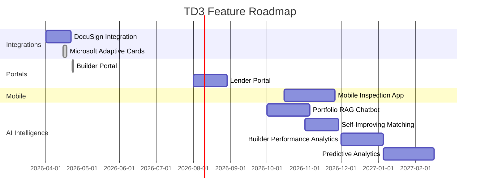

# TD3 Development Roadmap

**Last Updated:** April 2026

---

## Table of Contents

1. [Platform Status](#platform-status)
2. [Upcoming Features](#upcoming-features)
3. [AI Intelligence](#ai-intelligence)
4. [Feature Timeline](#feature-timeline)
5. [Related Documentation](#related-documentation)

---

## Platform Status

TD3's core platform is live and operational:

- Loan lifecycle management (origination through payoff)
- Budget import with AI-powered categorization to industry-standard cost codes
- Draw request processing with automated validation and flagging
- Wire batch funding with consolidated builder payments and audit trail
- Invoice AI extraction and deterministic matching with learning system
- Passwordless authentication with pre-authorized access and stackable permissions
- Row-level database security on all business tables
- Interactive dashboards with portfolio analytics and polymorphic reports
- User preferences (theme, font size, reduced motion, default dashboard)
- Unified activity log with admin feed, device metadata, and JSON diff view
- Interactive Outlook email notifications (Adaptive Cards) for funding and payoff verification
- Installable progressive web app with offline-capable assets
- Polymorphic homepage combining entity search, contextual header, and personal work queue into a single working surface

---

## Upcoming Features

### DocuSign Integration

Streamline loan origination by integrating electronic signature workflows directly into the platform. When a new loan is created, TD3 will automatically populate document templates with loan data and send them for signature. Once all parties have signed, the executed documents are stored in the loan record and the loan status advances automatically. For details on the loan lifecycle this integrates with, see [Technical Architecture: Loan Lifecycle Management](ARCHITECTURE.md#loan-lifecycle-management).

**Document types templated:**
- **Deed of Trust** -- Property-specific collateral agreement populated with parcel number, legal description, and loan terms
- **Promissory Note** -- Loan amount, interest rate, maturity date, and payment schedule pre-filled from the loan record
- **Personal Guaranty** -- Guarantor information and guarantee terms linked to the borrower and loan profiles
- Additional templates can be configured per lender or loan product type

**Template variable population:** Each document template contains merge fields that map directly to TD3's loan data model. When an envelope is created, fields like borrower name, property address, loan amount, interest rate, and maturity date are automatically populated---eliminating the manual copy-paste process that introduces errors.

**Expiration and reminder workflows:** Unsigned envelopes trigger automated reminders on a configurable schedule (e.g., 3 days, 7 days). Envelopes that remain unsigned past a deadline are flagged in the loan record as requiring follow-up. The processor can resend or void envelopes directly from the loan detail page.

**Completion tracking:** The loan detail view shows real-time signature status for every document in the envelope---which parties have signed, which are pending, and whether any have declined. Loan status cannot advance from Pending to Active until all required documents are fully executed.

This eliminates manual document preparation, reduces turnaround time, and ensures every loan has a complete, tamper-evident document trail.

### Microsoft Adaptive Cards (Outlook) — ✅ Shipped April 2026

Interactive email notifications for workflow items that require action. Recipients can fund wires, verify payoffs, and more directly from Outlook without opening the TD3 web app.

**Shipped cards:**
- **Funding Date Card** — sent to users with `fund_draws` permission when a wire batch is submitted. Bookkeeper inputs funded date and wire reference directly in Outlook.
- **Payoff Verification Card** — sent to users with `approve_payoffs` permission when a payoff is approved. Verifier approves or rejects (with reason) from Outlook.
- **Draw Review Card** — sent to users with `processor` permission when a builder submits a draw for review. Processor approves, requests revisions (with note), or rejects (with reason) from Outlook.

All three cards auto-refresh when opened, so recipients always see current state even if another user already acted.

**How it works:** Cards are sent via Microsoft Graph from a dedicated shared mailbox. User actions route back to TD3 API callbacks authenticated via Entra ID-signed JWT from Microsoft's Actionable Messages service. An auto-refresh hook ensures stale cards update to current state when re-opened, so a recipient seeing a card five days later sees the latest status rather than the stale snapshot. Cards are now one channel of the unified V2 notification pipeline (see [PERMISSIONS_NOTIFICATIONS_V2.md](PERMISSIONS_NOTIFICATIONS_V2.md)) — the same trigger that creates an in-app notification renders the card for users with an Outlook mailbox.

**Future: Microsoft Teams delivery.** The current implementation is Outlook-only via email. Teams delivery would require an Azure Bot Service subscription. On the roadmap if adoption grows but not a priority for launch.

### Polymorphic Homepage — ✅ Shipped April 2026

A single working surface that unifies entity search, contextual stat cards, and a personal work queue. Replaces the previous practice of landing users on the firm-wide dashboard (now at `/portfolio`) with a home view tailored to each user's attention.

For the full architecture and file layout, see [Homepage](HOMEPAGE.md).

**What the homepage is for:**

- **Find anything fast.** Typing in the hero search returns matches across nine entity types — projects, builders, subdivisions, lenders, draws, wires, invoices, documents, users. Relevance-ranked, permission-scoped. ⌘K / Ctrl+K focuses the input from anywhere on the page.
- **See what's happening without opening a detail page.** The polymorphic header under the search bar morphs into a per-entity stat card as the user types or pins an item. A project shows committed / drawn / remaining / last-draw at a glance. A builder shows active-loan count / committed / drawn YTD / historic count. Nine templates in total, one per entity type, swapped with a 180ms cross-fade so the UI never jumps.
- **Act on what needs attention.** The personal work queue at the bottom surfaces items waiting for the user — payoffs to verify, wires to fund, draws to review, documents about to expire, invoice matches needing a confidence check. Items are grouped by urgency, filterable by kind, and marked with a "N new since last visit" pill so the user can tell what's genuinely fresh from what they've already seen.

**How the three pillars work together:**

Most actions don't require navigating away from the homepage. Typing in search previews the top match in the polymorphic header — arrow down to different results, the header follows. Clicking a queue row pins that entity into the header, so the user can see the stats for the item they're about to action and decide whether to open it or pivot to something else. A "most recent wins" rule governs who owns the header at any moment: typing overrides a pin, pinning overrides typing, clearing returns to the user's personal portfolio summary.

**Slash commands.** Typing `/` as the first character switches the dropdown from entity results to a command palette. Twenty-seven commands across navigation, creation, context-aware actions, work-queue filters, and utility. Four navigation commands accept inline arguments, so `/builder curtis` surfaces matching builders as selectable sub-rows. Context commands only appear when an entity is pinned — `/open` navigates to it, `/history` pulls up its audit trail, `/loans` filters the portfolio to a pinned builder or lender.

**Work queue aggregation.** Queue items come from two sources: event-driven Postgres triggers that fire inline with the underlying state change (wire submitted → alert funders, payoff approved → alert verifiers), and an hourly aggregator cron that sweeps documents within 30 days of expiry and broadcasts alerts to every active processor. When any recipient of a broadcast item acknowledges it, a cascade RPC auto-resolves every other user's copy — one click clears the shared work item for the whole team without requiring a manual assignment schema.

**Header notifications bell.** The bell in the top chrome shares the same queue data. On the homepage, clicking a bell row pins the entity into the polymorphic header without navigating — it's a zero-friction way to jump into context for something you're about to act on. Off the homepage, the bell navigates as before. The unread count stays in sync between bell and homepage queue via a cross-surface event bus, so reading in one drops the badge in the other without a round-trip.

### Builder Portal — ✅ Shipped April 2026

**Why self-service matters:** Builders currently rely on phone calls, emails, and manual report generation to get updates on their loans. Every "what's the status of my draw?" inquiry requires a processor to look up the information and relay it---a pattern that scales linearly with portfolio size. The builder portal eliminates this overhead by giving builder teams real-time visibility into their own data, reducing support requests and freeing the internal team to focus on processing work.

**What builders can do:**
- View their own loans, balances, and draw history
- Review approved budgets by category with remaining amounts
- Create draft draws, attach invoices, and submit for processor review
- Receive real-time notifications when their draws are approved, sent back for revisions, rejected, or funded
- Download funded draw confirmations and wire details
- Manage notification preferences per event category (in-app vs email)

**Architecture:** Rather than building a parallel app, the builder portal reuses TD3's existing builder, project, and draw pages — gated by a new `builder_portal` permission and scoped by a `builder_members` table. Row-level security enforces data isolation: a builder sees only loans tied to a builder they're a member of. Pages outside their scope (`/portfolio`, `/staging`, `/admin/*`) bounce them back to their builder home via a permission redirect. Internal-only fields on shared pages (IRR, lender financials, processor notes, AI confidence scores) are wrapped in an `<InternalOnly>` component that hides them from non-staff viewers. One codebase, no duplication.

**Builder-submitted draw lifecycle:** Builder drafts go through a review state (`submitted_for_review`) before flowing into the existing wire batch pipeline. Processors see the new draw in their queue + as an Outlook Adaptive Card with Approve / Request Changes / Reject actions. Builders see status updates and any revision notes back in the same draw page they created.

For the full design — schema, RLS pattern, state machine, edge cases, and migration sequencing — see [PERMISSIONS_NOTIFICATIONS_V2.md](PERMISSIONS_NOTIFICATIONS_V2.md).

### Lender Portal

**Lender Portal:** Same architectural pattern as the builder portal once built — a `lender_portal` permission and `lender_members` scoping table on top of the existing `/lenders/[id]` and `/projects/[id]` pages, with a different `<InternalOnly>` boundary tuned for the lender audience. Read-only portfolio views filtered to their funded loans, loan summaries with current balances and LTV metrics, aggregate portfolio statistics, and exportable reports for internal lending reviews. Not yet scheduled.

### Mobile Inspection App

**The problem:** Construction site inspections today rely on paper checklists, standalone photo apps, and manual data entry. Inspectors capture photos on their phones, take notes on paper or in a separate app, then return to the office to manually enter findings into the loan management system. Photos are disconnected from the specific budget lines they document. Notes lack structured data that the system can act on. The gap between field observation and system record introduces delays, errors, and lost context.

**Technology approach:** The mobile inspection app will be built as a Progressive Web App (PWA), leveraging TD3's existing installable PWA infrastructure. This approach delivers a native app experience---home screen icon, offline support, camera access, GPS---without requiring App Store distribution. The same codebase and design language used in the main TD3 interface extend to the mobile experience, ensuring visual and behavioral consistency.

**Core capabilities:**

- **Map view** showing all active project locations with navigation and distance-based sorting
- **Inspection checklists** comparing draw request items against visible construction progress, with per-item pass/fail/partial status
- **Photo capture** with annotations tied to specific projects and budget categories---every photo links to the budget line it documents
- **GPS tagging** for automatic location verification, confirming the inspector is on-site
- **Offline support** for areas with poor connectivity, with automatic sync when connection is restored
- **Integration with TD3** -- inspection records, photos, and notes appear in the project detail view

**Budget-linked evidence:** The key differentiator is direct integration with TD3's budget structure. When an inspector photographs framing progress, that photo is linked to the specific framing budget line and its associated draw request. This creates a visual evidence trail that connects field observations to financial decisions---inspectors verify construction progress, and that verification flows directly into the draw approval process.

**Progress tracking against draw schedules:** Inspection data feeds into draw processing by providing field-verified evidence of construction progress. When a builder submits a draw for framing work, the processor can review inspection photos and checklist results for that specific budget category---reducing the need for separate progress verification steps.

---

## AI Intelligence

TD3's current AI capabilities---budget categorization, invoice extraction, and invoice-to-budget matching---are documented in the [Artificial Intelligence](ARTIFICIAL_INTELLIGENCE.md) guide. The features below build on that foundation, extending the platform's intelligence from individual-transaction decisions to portfolio-wide learning and prediction.

A critical enabler for these features is TD3's [standardized cost code system](ARTIFICIAL_INTELLIGENCE.md#td3s-standardized-cost-code-system). Because every builder's budget is mapped to a single canonical set of 89 subcategories, data from different projects and builders becomes directly comparable---the prerequisite for meaningful cross-loan analytics. Without standardization, a builder's "Mechanical Rough-in" cannot be compared to another builder's "HVAC Labor"---with it, both map to the same cost code and become data points in the same analysis.

### Portfolio Intelligence (RAG Chatbot)

**The problem:** Answering questions about portfolio data today requires either manual SQL queries, navigating through multiple pages and filters, or exporting data to spreadsheets for ad-hoc analysis. Simple questions like "which loans are approaching maturity?" involve visiting several screens and mentally assembling the answer. Complex cross-project queries---comparing budget utilization across builders, for instance---are impractical without technical skills.

**The solution:** A natural-language query interface that allows users to ask questions about their portfolio data conversationally:

- "What's the total outstanding balance across all active loans?"
- "Show me draws funded this month for Builder X"
- "Which loans are approaching maturity?"
- "Compare budget utilization across active projects"

**How RAG works:** Retrieval-Augmented Generation (RAG) combines database retrieval with AI reasoning. When a user asks a question, the system first retrieves the relevant data context---loan records, budget figures, draw history---then sends that context alongside the question to an AI model. The model reasons about the data and returns a formatted, human-readable answer with tables, summaries, and supporting detail.

**Why RAG over a raw LLM:** Grounding the AI's response in actual retrieved data prevents hallucination---the model cannot fabricate loan balances or draw amounts because it only works with real records from the database. All data stays within the platform's security boundary; nothing is sent externally without the user's query context. Row-level security ensures users only see data they're authorized to access.

**Why cost codes are the key:** TD3's [standardized cost code system](ARTIFICIAL_INTELLIGENCE.md#td3s-standardized-cost-code-system) is what makes cross-project queries possible. Because every builder's budget maps to the same 89 canonical subcategories, the chatbot can compare framing costs across five different builders---even though each builder originally labeled the line item differently. Without standardization, cross-project analytics would require manual normalization for every query.

The chatbot will translate questions into database queries, present results in formatted tables and summaries, and support multi-step analytical reasoning for complex questions.

### Self-Improving Invoice Matching

TD3 already captures structured [training data](ARTIFICIAL_INTELLIGENCE.md#training-data-and-the-path-to-self-improvement) every time a draw is funded: vendor-to-category associations, human corrections, confidence calibration data, and amount patterns. The data collection infrastructure is in place; this feature activates the feedback loop.

**How it works:**

- **Vendor history as context** -- When the AI evaluates a new invoice, it receives the vendor's complete match history as few-shot examples in the prompt. A vendor matched to HVAC categories across five previous projects carries strong prior evidence for the next match.
- **Human corrections weighted heavily** -- When a reviewer overrides an AI suggestion, that correction carries more weight than an accepted auto-match. Corrections represent the cases where the AI was wrong, making them the most valuable signal for improvement.
- **Confidence recalibration** -- Comparing the AI's reported confidence against actual outcomes over time reveals systematic miscalibration. If the model reports 80% confidence on a certain class of invoices but is actually correct 95% of the time, thresholds can be refined to reduce unnecessary human review.
- **Few-shot learning** -- Concrete examples of past matches---including the reasoning and outcome---are more effective than abstract instructions. The AI sees "last time you matched a Pacific Insulation invoice, you correctly assigned it to Insulation/Drywall/Paint" rather than a generic rule.

The result is a virtuous cycle: more funded draws produce more training data, which produces more accurate matching, which requires less human intervention. Early loans require the most human review; as the vendor knowledge base grows, the ratio of auto-approved to manually-reviewed invoices shifts steadily toward automation. See the [self-improvement loop](ARTIFICIAL_INTELLIGENCE.md#the-self-improvement-loop) for a detailed diagram of this feedback cycle.

### Builder Performance Intelligence

As historical data accumulates across completed loans, TD3 can analyze builder performance at a depth that individual spreadsheets cannot achieve. This is made possible by the [standardized cost code system](ARTIFICIAL_INTELLIGENCE.md#td3s-standardized-cost-code-system)---because every builder's budget maps to the same 89 subcategories, comparison across builders and projects is meaningful rather than approximate.

**Builder benefits:**

- Self-assessment on timeline adherence, budget accuracy, and draw frequency patterns
- Category-level analysis showing where a builder consistently comes in over or under budget
- Trend tracking across sequential projects to measure operational improvement
- Vendor performance insights---which subcontractors deliver on budget, which consistently exceed estimates

**Lender benefits:**

- Risk scoring based on historical budget accuracy, draw patterns, and project completion timelines
- Side-by-side builder comparison using standardized metrics across the same cost categories
- Early warning indicators when a current project deviates from a builder's historical baseline
- Portfolio concentration analysis---exposure by builder, geographic area, and project size

The key insight is that standardized cost codes transform builder data from isolated project records into a connected performance history. A builder's framing costs across ten projects tell a story that no single project budget can.

### Predictive Analytics

Using the historical performance data assembled by builder intelligence, TD3 can project forward to forecast outcomes on active and prospective loans.

**Forecasting capabilities:**

- **Cash flow projection** -- Based on a builder's historical draw cadence and the current project's budget structure, forecast when draws are likely to be submitted and funded.
- **Budget risk modeling** -- Identify cost categories where the builder has historically exceeded budget, and flag those categories on new projects before construction begins.
- **Completion timeline estimation** -- Use the builder's track record on similar-sized projects to estimate realistic completion dates, accounting for seasonal patterns and historical delays.
- **Portfolio-level planning** -- Aggregate individual project forecasts into portfolio-wide cash flow projections, helping lenders plan capital allocation and liquidity.
- **Market condition signals** -- Track cost trends across the portfolio to identify material price shifts, labor market tightness, or regional cost pressures before they impact individual loan performance.

These capabilities are enabled by the [standardized cost code system](ARTIFICIAL_INTELLIGENCE.md#td3s-standardized-cost-code-system) creating a unified data model. When every project uses the same category structure, historical patterns from completed loans can be directly applied to forecast outcomes on new ones.

The accuracy of these predictions improves with portfolio size. Early forecasts rely on industry benchmarks and the builder's limited history. As a builder completes more projects through TD3, the predictions become increasingly precise---calibrated to that specific builder's patterns, preferred subcontractors, and typical project profile. See the [training data](ARTIFICIAL_INTELLIGENCE.md#what-td3-captures-today) documentation for details on the data foundation.

---

## Feature Timeline

---

## Related Documentation

| Document | Contents |
|----------|----------|
| [Artificial Intelligence](ARTIFICIAL_INTELLIGENCE.md) | AI pipeline, cost code system, confidence model, and training data |
| [Technical Architecture](ARCHITECTURE.md) | System architecture, data model, and deployment |
| [Security](SECURITY.md) | Authentication, permissions, data-level enforcement, and audit trail |
| [Design Language](DESIGN_LANGUAGE.md) | Design philosophy, color system, polymorphic behaviors, and accessibility |
| [Glossary](GLOSSARY.md) | Definitions of key construction lending, financial, and platform terms |
| [README](../README.md) | Project overview, workflow summary, and documentation index |

---

*© 2024-2026 TD3, built by Grayson Graham. All rights reserved.*
