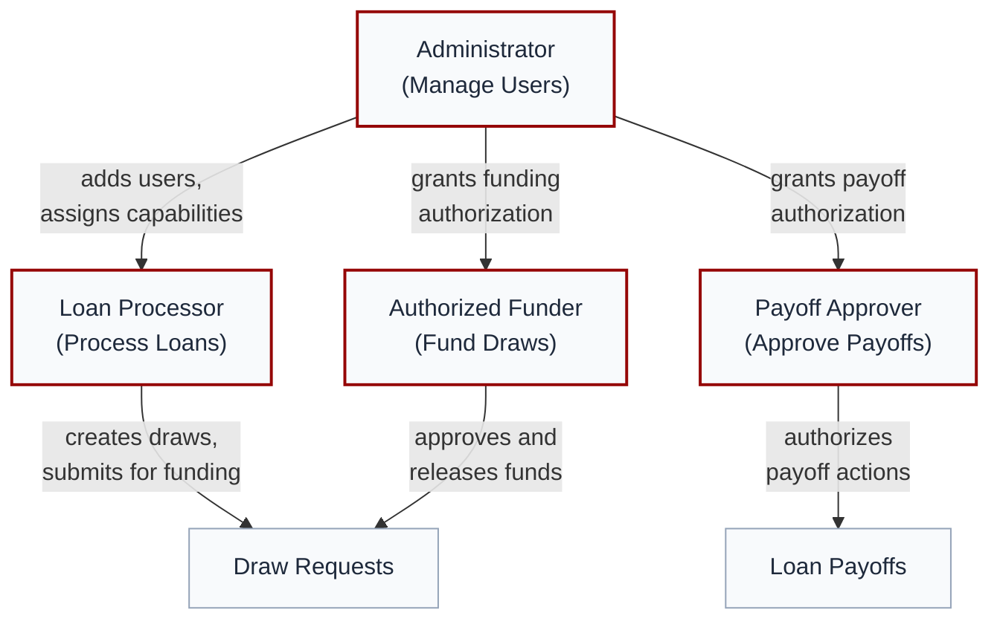

# Security

> How TD3 protects your construction loan data at every layer --- from sign-in to database.

---

## Table of Contents

1. [Overview](#overview)
2. [Authentication: Who Can Sign In](#authentication-who-can-sign-in)
3. [Permissions: What Each User Can Do](#permissions-what-each-user-can-do)
4. [Data-Level Enforcement](#data-level-enforcement)
5. [Audit Trail](#audit-trail)
6. [Financial Data Protection](#financial-data-protection)
7. [AI Security Guardrails](#ai-security-guardrails)
8. [External Integration Security](#external-integration-security)
9. [Interface Adaptation](#interface-adaptation)
10. [Infrastructure Security](#infrastructure-security)
11. [Related Documentation](#related-documentation)

---

## Overview

Construction loan data demands rigorous protection. Budgets, draw requests, wire transfers, and builder banking information are high-value targets, and a single unauthorized change to a funded amount or wire instruction could have serious financial consequences.

TD3 addresses this with **defense in depth** --- multiple independent security layers, each enforcing its own rules:

- **Authentication** controls who can sign in.
- **Permissions** control what each user can do.
- **Data-level enforcement** means the database independently verifies every operation, regardless of how it was initiated.
- **An immutable audit trail** records every significant action.
- **AI guardrails** ensure automated decisions stay within human-defined boundaries.

Each layer works on its own, so a failure in one does not compromise the others.

---

## Authentication: Who Can Sign In

**The risk:** Stolen or guessed credentials are the most common entry point for unauthorized access. Password-based systems are vulnerable to phishing, credential stuffing, and reuse attacks. Email links can be intercepted or triggered by automated scanners.

**What TD3 does:** TD3 uses **passwordless one-time codes** for every sign-in. When a user requests access, TD3 sends an 8-digit numeric code to their registered email address. The code expires after a short window and can only be used once. There are no passwords to steal, no links to intercept, and no credentials stored on the user's device.

Access is further restricted by a **pre-authorized access list**. An administrator must explicitly add a user's email address before that person can sign in --- even with a valid code. There is no self-registration, no public sign-up form, and no way for an unauthorized person to create an account.

Sessions are tracked server-side with automatic timeouts after periods of inactivity. Session tokens are refreshed on every request to limit the window of exposure if a token is compromised.

---

## Permissions: What Each User Can Do

**The risk:** In construction lending, different people play different roles. A loan processor entering draw data should not have the authority to release funds. Without clear separation of duties, a single compromised account could manipulate both the data and the money.

**What TD3 does:** TD3 enforces a **layered permission model** with strict separation of duties. Permissions fall into two layers that compose at the database level:

**Staff capabilities** (firm-wide TD3 roles, stackable — each user holds only the capabilities their role requires):

| Capability | What It Grants |
|---|---|
| **Process Loans** | Create and edit projects, budgets, draw requests, and invoices |
| **Fund Draws** | Approve draws and release funds through wire batches |
| **Approve Payoffs** | Authorize loan payoff actions |
| **Manage Users** | Control the access list and assign permissions to other users |

**Builder Portal** (external builder team access, scoped to specific builders):

| Capability | What It Grants |
|---|---|
| **Builder Portal** | Sign in as an external builder user. Scoped to one or more specific builders via the `builder_members` table — the user sees only loans, draws, and documents tied to a builder they're a member of. Does not grant any staff capability. |

A user can hold any combination of staff capabilities. Critically, the person processing a draw is not necessarily the person authorized to fund it --- this separation is enforced at every level of the system, not just the interface.

**Builder users are fully isolated.** A builder team member with only the Builder Portal capability can see their own builder page, their loan details, and their draw history, but cannot see other builders' loans, cannot access the portfolio dashboard or wire staging, and cannot read internal-only fields (IRR, lender financials, processor notes, AI confidence scores) even on pages they can visit. Isolation is enforced by row-level security at the database and by interface gating at the application, independently — a direct API call by a builder user against another builder's data is rejected by the database regardless of what the application renders.

---

## Data-Level Enforcement

**The risk:** Application-level security alone is insufficient. If security rules exist only in the user interface, a sophisticated attacker who bypasses the interface --- through a direct API call or a compromised integration --- could read or modify data without authorization.

**What TD3 does:** TD3 enforces security rules **at the database itself**, independent of the application layer. Every query the database receives is evaluated against a comprehensive set of access policies before any data is returned or modified. These policies verify the user's identity and capabilities on every single operation --- SELECT, INSERT, UPDATE, and DELETE.

This means:

- **Read operations** on business data require an authenticated session. For shared tables (projects, draws, builders, documents), the access policy combines the two permission layers disjunctively: staff see every row; builder users see only rows tied to a builder they're a member of.
- **Write operations** (creating or modifying projects, budgets, draws, and invoices) require the Process Loans capability. Builder users can create draft draws on their own loans and submit them for review, but cannot bypass processor approval or write to any other builder's records.
- **Funding operations** (marking draws or wire batches as funded) require the Fund Draws capability, enforced by both the access policy and a secondary database-level trigger that acts as a backup check.
- **Administrative operations** (managing the access list and user permissions) require the Manage Users capability for all operations, including viewing the list.

**Banking data is masked by default.** Builder bank routing and account numbers are stored in full for the bookkeeper's wire workflow, but every other rendering surface — Adaptive Cards, fallback HTML emails, and most in-app views — shows only the last four digits through dedicated generated columns. The plaintext values are only accessible on the wire staging page (where the bookkeeper actually initiates wires) and on the builder-owned BuilderInfoCard. This keeps full banking numbers out of inboxes, screenshots, and any report exported for external review.

Even if the application interface were completely bypassed, the database would independently reject any unauthorized operation. The application and the database each enforce the full permission model --- two independent gatekeepers, not one.

---

## Audit Trail

**The risk:** In construction finance, disputes and compliance reviews can surface months or years after a transaction. Without a reliable record of who did what and when, reconstructing the history of a loan becomes guesswork.

**What TD3 does:** TD3 records every significant action in an **append-only audit trail**. Each entry captures the user who performed the action, a precise timestamp, and the details of what changed. Audit entries cannot be modified or deleted --- not by users, not by administrators, not by the application itself.

Once a draw is funded, the associated records become **immutable**. Budget amounts, draw line items, wire batch details, and invoice matches are locked as a permanent financial record. This ensures that the data visible during a compliance review is identical to the data that existed at the time of funding.

The audit trail supports:

- **Compliance reviews** --- Trace any funded amount back through the complete decision chain, from initial data entry through final wire confirmation.
- **Dispute resolution** --- Determine exactly who approved a draw, when it was funded, and what supporting documentation was attached.
- **Historical reconstruction** --- Recreate the state of any loan at any point in its lifecycle using the recorded action history.
- **Notification auditability** --- A separate `notification_deliveries` table is the source of truth for "have we already sent this notification?" — it records every send, suppression, and failure with a unique key per (user, channel, event). Administrators can answer "did that payoff verification email actually go out?" without grepping logs, and the dispatcher uses the same table to guarantee that re-claimed outbox rows never double-fire emails or queue items.

---

## Financial Data Protection

**The risk:** Financial calculations in construction lending involve concurrent operations --- multiple draws funded against the same budget, wire batches consolidating draws from different requests. If these operations are not carefully coordinated, race conditions can lead to double-counting, over-funding, or inconsistent balances.

**What TD3 does:** TD3 performs all budget calculations **atomically at the database level**, not in application code. When a draw is funded, the database updates the budget's spent amount in a single, indivisible operation that cannot be interrupted or corrupted by concurrent requests. This eliminates the class of bugs where two simultaneous funding actions could both read the same balance and both apply their changes, resulting in an incorrect total.

Wire batches consolidate multiple draw requests for the same builder into a single wire transfer, reducing banking fees and simplifying bookkeeping. Each batch includes a detailed funding report with per-draw breakdowns and builder banking information.

Historical snapshots are preserved at each stage of the draw lifecycle. Interest accrual and fee calculations are performed server-side using auditable formulas, ensuring that every number in the system can be traced back to its inputs and calculation method.

---

## AI Security Guardrails

**The risk:** AI systems that operate without oversight can make errors that propagate through financial workflows. An incorrect invoice match applied automatically could lead to draws funded against the wrong budget category, distorting the loan's financial picture.

**What TD3 does:** TD3 uses AI to assist with invoice data extraction and invoice-to-budget matching, but every AI decision operates within strict security boundaries. The AI never acts unilaterally on financial data --- its authority is **gated by confidence scoring**:

- **High confidence (95% or above):** The match is applied automatically. These represent clear, unambiguous alignments where the AI's certainty is comparable to a human expert's.
- **Moderate confidence (70--94%):** The match is suggested and pre-applied, but a human reviewer must confirm it with a single action before it affects any financial record.
- **Low confidence (below 70%):** The AI's suggestion is stored for reference, but no match is applied. A human must perform full manual review and selection.

Every AI decision --- automatic or human-reviewed --- is logged with the confidence score, the reasoning behind the match, and the final outcome. This creates a complete, auditable record of how each invoice was matched to its draw line.

Communication between the AI engine and TD3 uses **encrypted, authenticated channels**. Both ends verify a shared cryptographic secret on every request. If verification fails, the request is rejected entirely.

> For the full AI architecture, including the confidence model and training pipeline, see [Artificial Intelligence: Confidence and Trust](ARTIFICIAL_INTELLIGENCE.md#confidence-and-trust).

---

## External Integration Security

**The risk:** External systems that communicate with a financial platform create potential attack surfaces. Forged callbacks, intercepted payloads, or stale endpoint URLs could allow unauthorized data modification or information disclosure.

**What TD3 does:** All communication between TD3 and external systems uses **cryptographic authentication**. Every incoming request from an external service includes a shared secret that TD3 verifies using a timing-safe comparison algorithm --- a technique that prevents attackers from gradually guessing the secret by measuring response times.

TD3 operates on a **fail-closed** principle: if the verification secret is missing, empty, or incorrect, the request is rejected outright. There is no fallback mode, no warning-and-proceed, and no partial processing. A failed verification is a hard stop.

External systems never have direct access to the database. All external communication flows through authenticated API endpoints that enforce the same permission model as the rest of the application. Callback URLs are pinned to the **production domain**, not deployment-specific URLs that could change between releases --- ensuring that external systems always communicate with the correct, stable endpoint.

---

## Interface Adaptation

**The risk:** When users see controls and actions they cannot perform --- even if those controls are disabled --- it reveals information about the system's capabilities. This creates social engineering opportunities ("Can you click the Fund button for me?") and unnecessary complexity in the interface.

**What TD3 does:** TD3 adapts the interface to each user's permission set. Controls and actions that a user cannot perform are **completely hidden**, not grayed out or disabled. A user with only the Process Loans capability never sees funding controls. A user without Manage Users capability never sees the access list.

This approach serves two purposes: it keeps the experience clean and focused for each user, and it reduces the attack surface for social engineering by eliminating visibility into capabilities the user does not have.

> For details on how the interface adapts to user roles, see [Design Language](DESIGN_LANGUAGE.md#7-polymorphic-behaviors).

---

## Infrastructure Security

**The risk:** Even a well-designed application is vulnerable if the underlying infrastructure is compromised. Unencrypted data, missing backups, or untested deployments can undermine every other security measure.

**What TD3 does:** TD3 runs on **enterprise-grade cloud infrastructure** with SOC 2 compliance, providing institutional-level security controls for hosting, networking, and data storage.

- **Encryption everywhere:** All data is encrypted in transit using TLS and encrypted at rest on disk. No construction loan data ever travels or sits unprotected.
- **Automated backups:** Daily automated backups with point-in-time recovery ensure that data can be restored to any moment, protecting against both accidental loss and malicious tampering.
- **Staging environment:** All changes are tested in a staging environment with preview deployments before reaching production. No untested code touches live loan data.
- **Row-level security:** Every single database query is evaluated against the permission policies described in this document. This is not a periodic check --- it happens on every read and every write, every time.
- **Continuous deployment:** Automated builds with type checking and validation on every code change ensure that security regressions are caught before deployment.

---

## Related Documentation

| Document | Contents |
|----------|----------|
| [README](../README.md) | Project overview, workflow summary, and documentation index |
| [Architecture](ARCHITECTURE.md) | System architecture, data model, and deployment |
| [Artificial Intelligence](ARTIFICIAL_INTELLIGENCE.md) | AI pipeline, cost code system, confidence model, and training data |
| [Design Language](DESIGN_LANGUAGE.md) | Design philosophy, color system, polymorphic behaviors, and accessibility |
| [Glossary](GLOSSARY.md) | Definitions of key construction lending, financial, and platform terms |
| [Roadmap](ROADMAP.md) | Upcoming features, timeline, and development priorities |

---

*TD3 Security --- © 2024-2026 TD3, built by Grayson Graham --- Last updated: February 2026*
